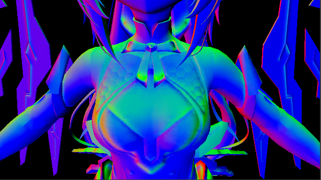

## Outline Selection

This section is used to control the character’s Normal Map settings, adding more surface detail and improving the appearance of lighting and shadows.

### Parameters

- **Normal Strength :** Controls the intensity of the Normal Map and how strongly it affects the surface details

### Preview NormalMap Pass

