## Outline

  

    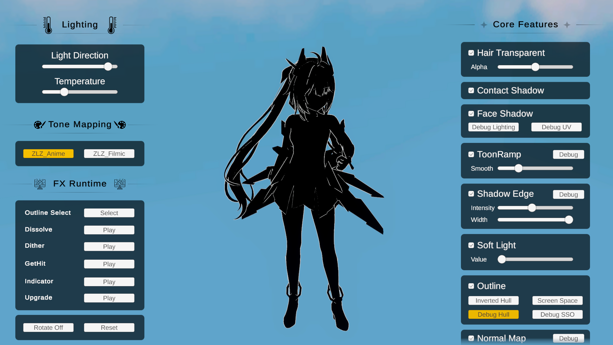
  

  

    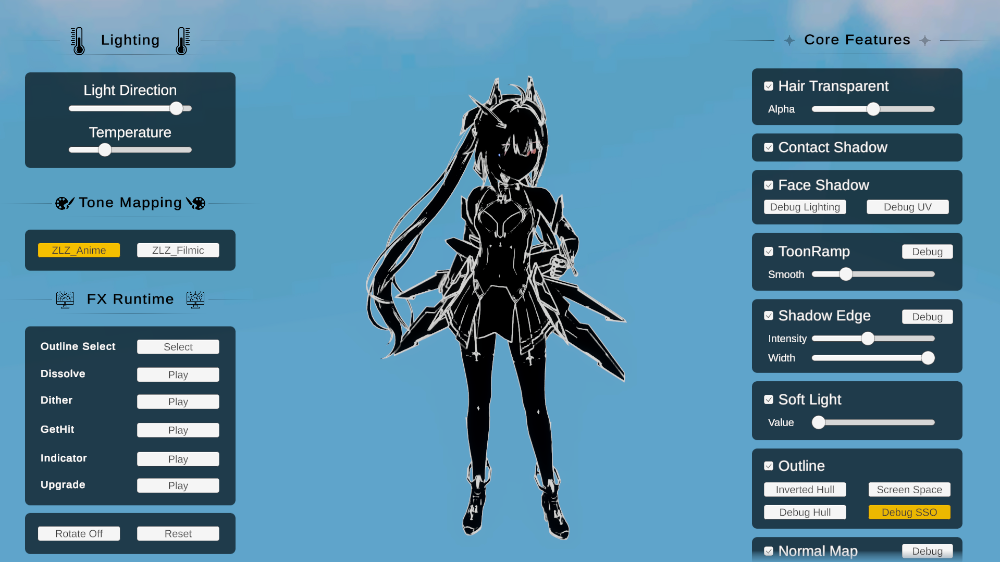
  

  

  
Debug Hull

  
Debug SSO

---

## Shared (Hull & Screen Space)

### Hull vs Screen Space

Two ways to draw the outline. Each makes a different kind of line:

| | Inverted Hull | Screen Space Outline |
|---|---|---|
| **Draws** | The character’s outer silhouette | Interior detail lines (creases, overlapping parts) |
| **Built from** | Extruded mesh geometry (per-object) | The character’s depth & normals (screen space) |
| **Line weight** | Follows the model and camera distance | Constant width in pixels on screen |

### Setup

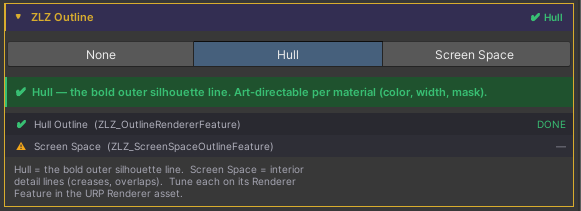

The outline is managed from one place: **Character Dashboard > ZLZ Outline**. Enable it there and choose the type (**Inverted Hull** or **Screen Space**); the Dashboard installs and configures everything for you, including filling in **Character Layers** when you pick Screen Space.

**Where each type’s settings live**

- **Inverted Hull :** on the character **material** (the Outline section)
- **Screen Space :** on its **Renderer Feature** in the **Universal Renderer Data**

### Outline Mask

  

    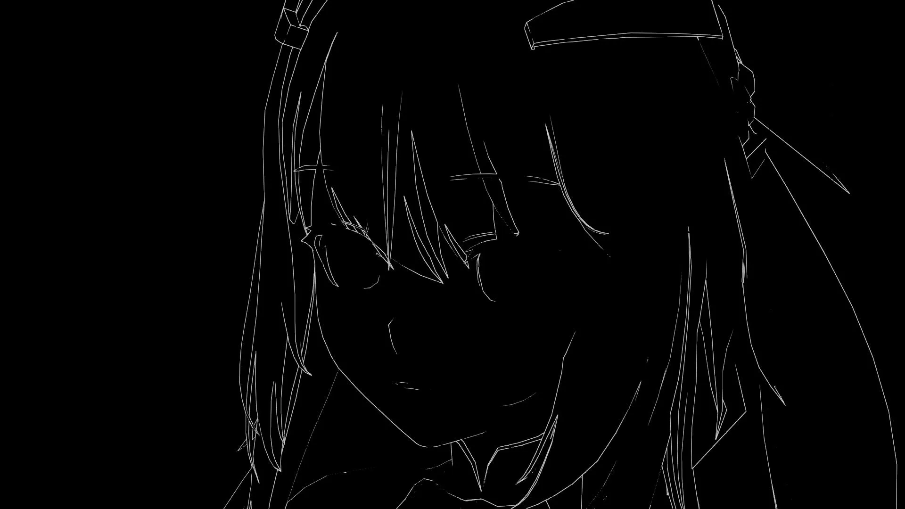
  

  

    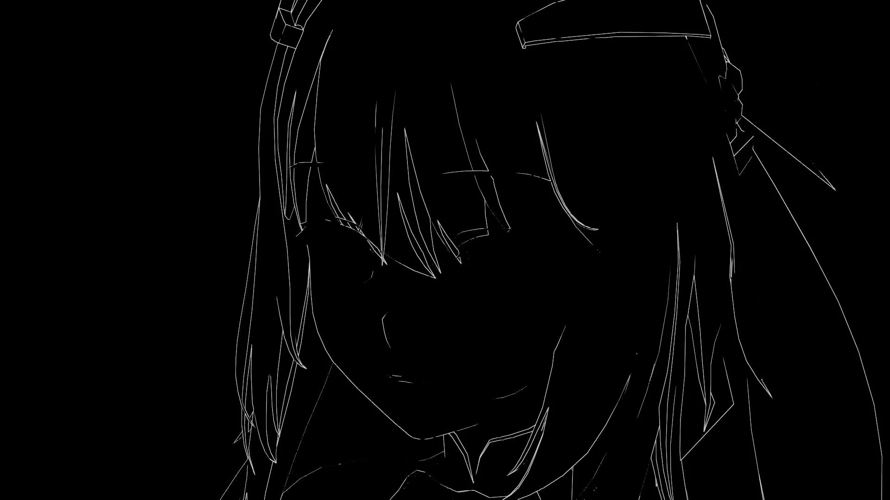
  

  

  
Mask Off

  
Mask On

The Outline Mask lets you **hide the outline on chosen parts** of the character (the inside of the mouth, eyes, or small props) from one setting that drives **both** outline methods.

Because the outline is a core part of the shader, the Outline Mask is **always available** in the material’s **Outline** section. No other feature needs to be enabled first.

- Tick **Use Mask** and pick a channel from the **Feature Mask** system
- Paint the chosen channel:
    - **White (1) = show the outline**
    - **Black (0) = hide the outline**
- The same mask drives both methods, so you set it once

> Selecting a channel automatically reveals the matching texture slot in the **Mask Layout** section, where you can pack it alongside other feature masks with the **ZLZ Mask Packer**.

### Compare Inverted Hull vs Screen Space

  

    
  

  

    
  

  

  
Inverted Hull Near

  
Screen Space Near

  

    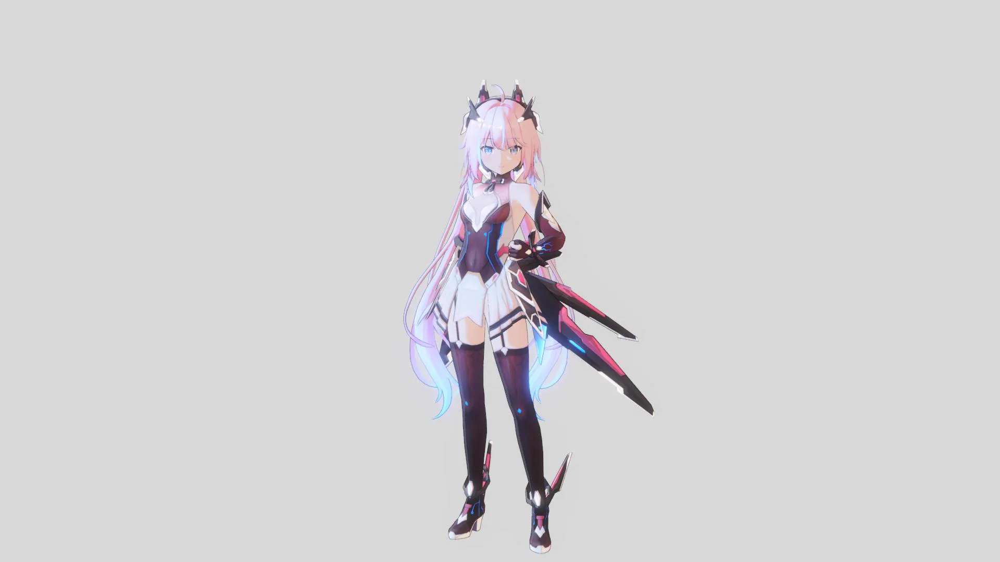
  

  

    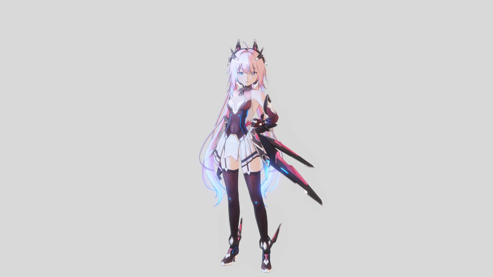
  

  

  
Inverted Hull Far

  
Screen Space Far

---

## Inverted Hull Outline

The default outline. After running the Character Dashboard Setup it is enabled automatically.

### ZLZ Smooth Normal Bake
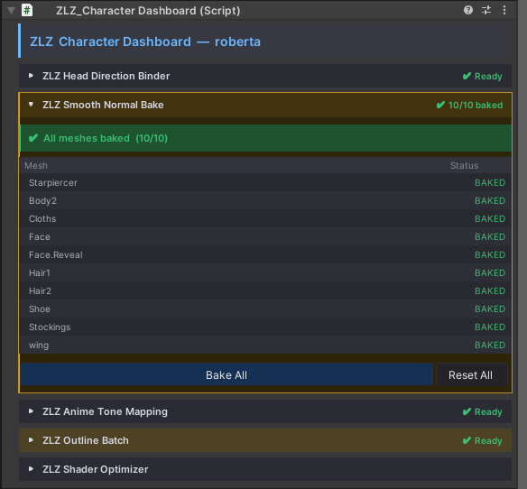

When installing the ZLZ_Character Dashboard, the system will automatically bake everything for you.  
This helps make the outline smoother and cleaner, ensuring the highest outline quality.  
If the mesh is updated later, simply press “Bake All” to rebake and finish the setup.  

  

    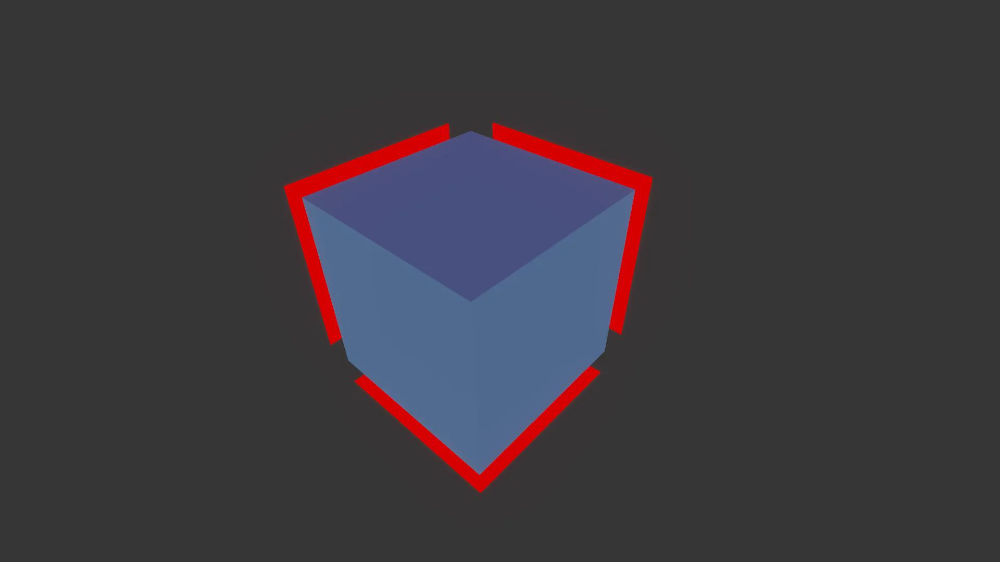
  

  

    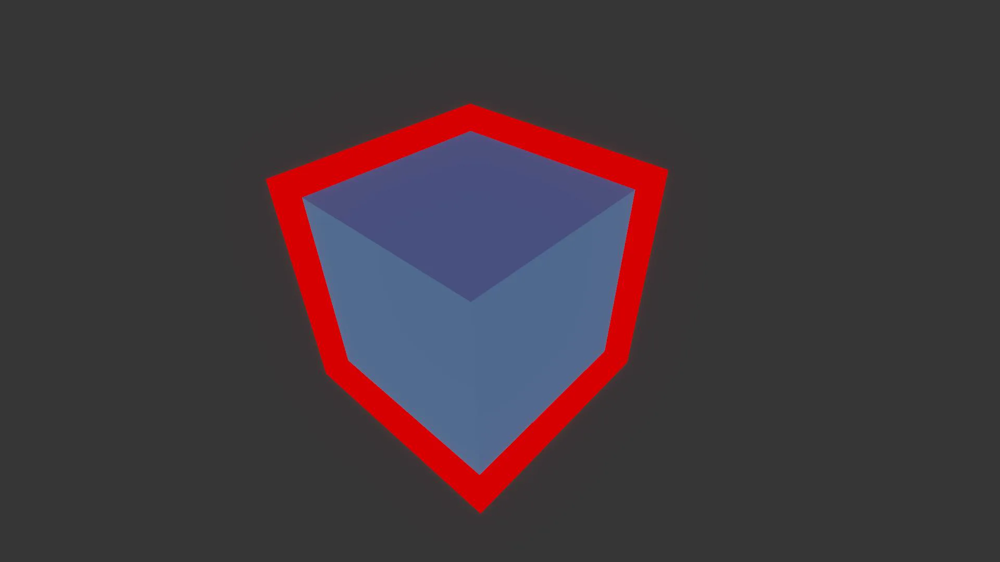
  

  

  
No SmoothNormalBake

  
SmoothNormalBake

---

### ZLZ Outline Batch

ZLZ Outline Batch automatically optimizes outline rendering by generating shared batching tags,  
reducing unnecessary draw calls while preserving the original visual quality.

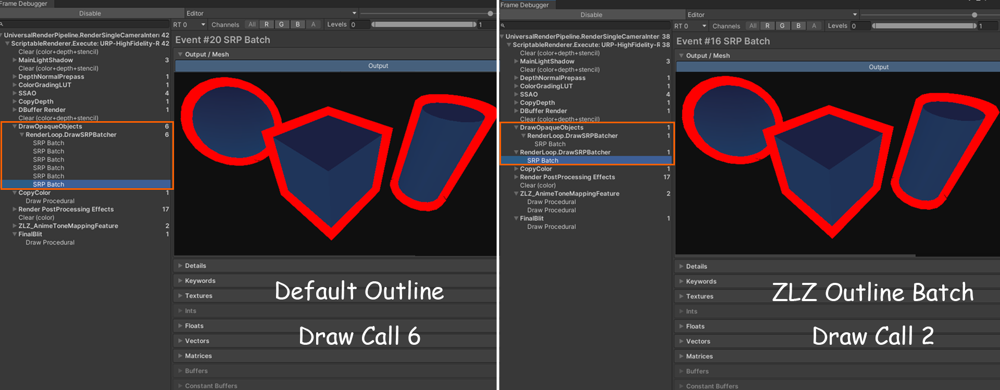

---

### Parameters

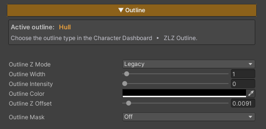

- **Outline Z Mode :** Provides two modes:
    - **Legacy :** Allows the use of Outline Z Offset, but may cause issues with certain types of reflections
    - **Planar Safe :** Resolves compatibility issues with some reflection types, but disables the use of Outline Z Offset
- **Outline Width :** Adjusts the thickness of the outline
- **Outline Intensity :** Controls the brightness of the outline *(0 = black / 1 = uses the Base Color from the Main Texture)*
- **Outline Color :** Directly sets the outline color
- **Outline Z Offset :** Adjusts the offset distance of the outline from the character surface, used to prevent z-fighting with the surface or to increase outline prominence

---

### Example Outline Colors

  

    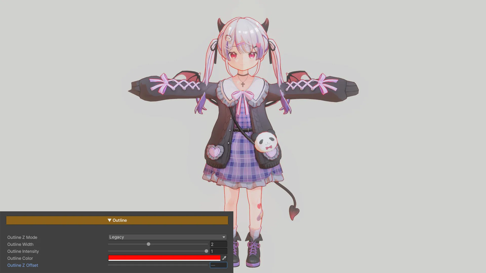
  

  

    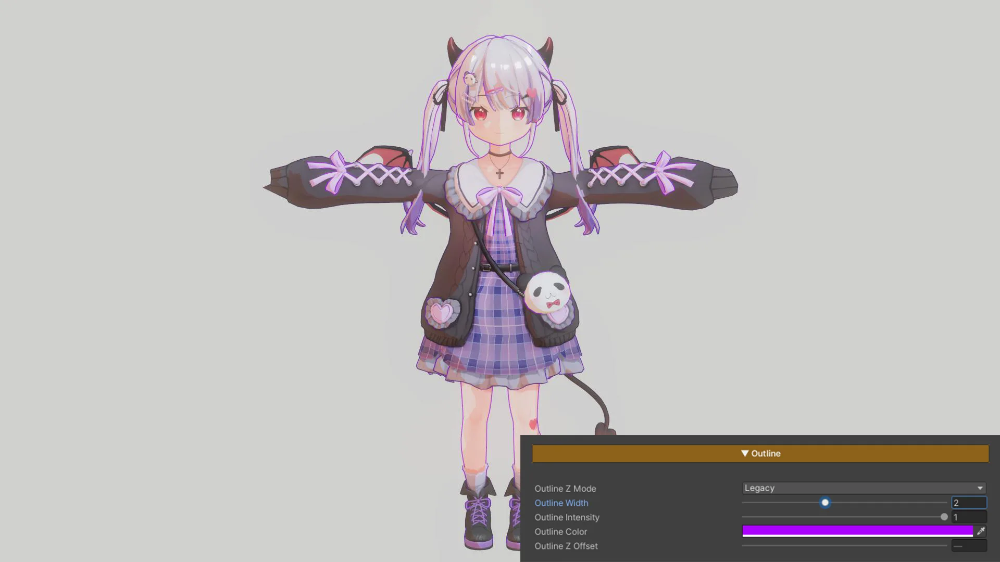
  

  

  
Outline Showcase Color Example1

  
Outline Showcase Color Example2

---

### Example Z Offset

  

    
  

  

    
  

  

  
  
Outline Z Offset : 0

  
Outline Z Offset : 0.025

---

## Screen Space Outline (SSO)

A URP Renderer Feature that draws outlines from the character's depth and normals, without adding geometry.

The inverted hull handles the outer silhouette. Screen Space Outline adds the interior lines a hull can't reach: folds in clothing, hair over the face, fingers, and layered armor.

### Parameters

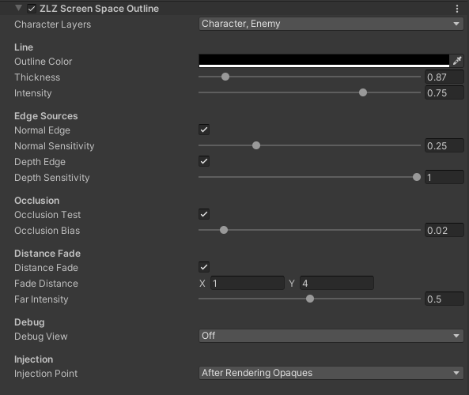

**Layers**

- **Character Layers :** Layers treated as characters. Only these get an outline. The Dashboard fills this in during Setup.

**Line**

- **Outline Color :** Line color
- **Thickness :** Line width in **pixels** *(0.5 - 4)*. Stays consistent on screen at any distance
- **Intensity :** Line strength / alpha *(0 = invisible / 1 = full)*

**Edge Sources**

- **Normal Edge :** Lines where the surface bends sharply, like creases and folds
    - **Normal Sensitivity :** higher = more edges
- **Depth Edge :** Lines where one part overlaps another, leaving a depth gap
    - **Depth Sensitivity :** higher = catches smaller gaps

**Occlusion**

- **Occlusion Test :** Hides the line where the character is behind scene geometry
    - **Occlusion Bias :** depth tolerance; only matters when partially occluded

**Distance Fade**

- **Distance Fade :** Fades the outline out with distance from the camera
    - **Fade Distance :** in metres. `x` = fade starts, `y` = fully faded
    - **Far Intensity :** strength at the far distance *(0 = gone)*

**Debug**

- **Debug View :** Shows one channel full-screen to tune a slider. Keep **Off** for normal rendering.
    - **Coverage :** the character area
    - **Normal Edge :** edges from surface orientation
    - **Depth Edge :** edges from depth gaps
    - **Combined Edge :** both edge sources
    - **Distance Fade :** how the line fades
    - **Occlusion :** where the line is hidden

**Injection** *(advanced)*

- **Injection Point :** When the pass runs in the pipeline. **After Rendering Opaques** fits most projects; change only if needed.
