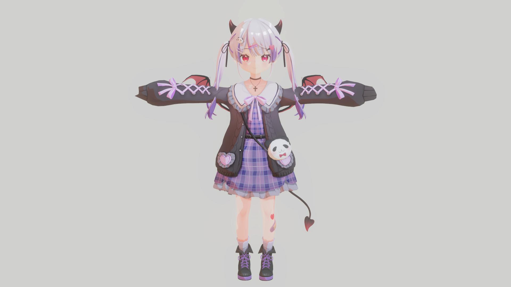
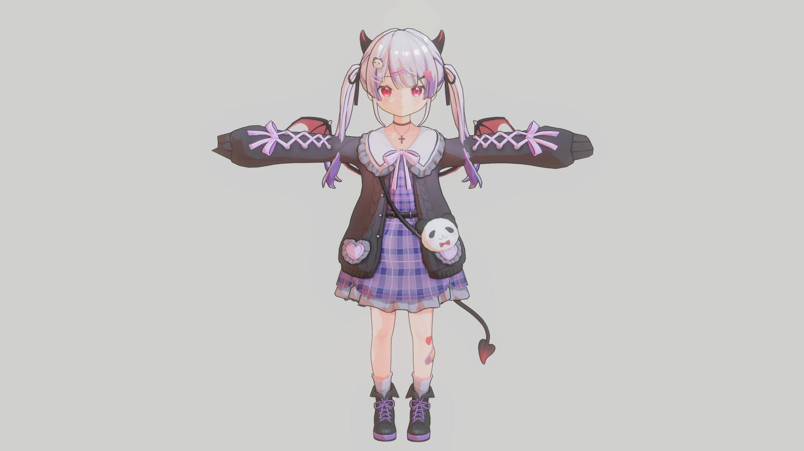
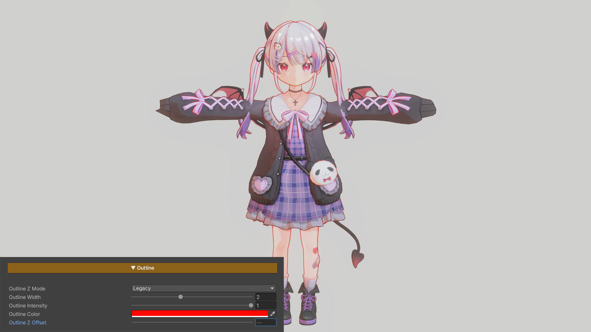
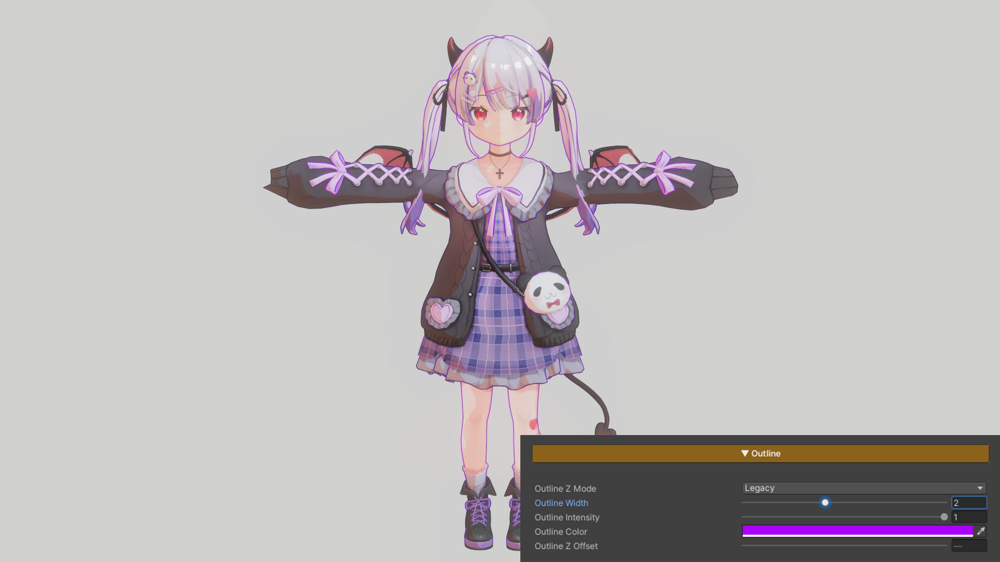
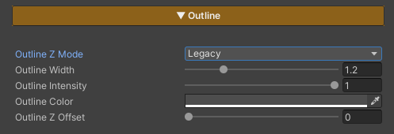

## Outline

  

    
  

  

    
  

  

  
Outline Off

  
Outline On

  

    
  

  

    
  

  

  
Outline Showcase Color Example1

  
Outline Showcase Color Example2

  

    
  

  

    
  

  

  
Outline Z Offset : 0

  
Outline Z Offset : 0.025

### Parameters

- **Outline Z Mode :** Provides two modes:
    - **Legacy —** Allows the use of Outline Z Offset, but may cause issues when used with certain types of reflections
    - **Planar Safe —** Resolves compatibility issues with some reflection types, but disables the use of Outline Z Offset
- **Outline Width :** Adjusts the thickness of the outline
- **Outline Intensity :** Controls the brightness of the outline *(0 = black / 1 = uses the Base Color from the Main Texture)*
- **Outline Color :** Directly sets the outline color
- **Outline Z Offset :** Adjusts the offset distance of the outline from the character surface, used to prevent z-fighting with the surface or to increase outline prominence

---
