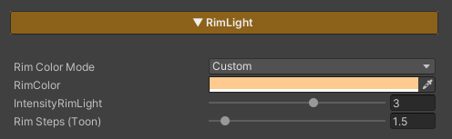

## Rim Light

Rim Light is used to add lighting along the edges of the character to emphasize the silhouette and help the character stand out more clearly from the background. It is well suited for toon- and anime-style characters.

### Parameters

- **Rim Color Mode :** Selects the color mode of the Rim Light
    - ***Light* :** Uses the color from the Directional Light
    - ***Custom* :** Allows you to define a custom Rim Light color
- **Rim Color :** Sets the Rim Light color when using the Custom mode
- **Intensity RimLight :** Controls the brightness of the Rim Light
- **Rim Steps (Toon) :** Controls the toon-style appearance of the Rim Light *(higher values cause the Rim Light to extend further into the character surface, while lower values produce a sharper and more defined rim edge)*

---
