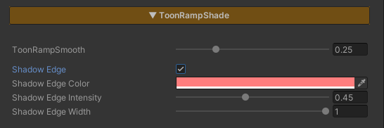

## Shadow Edge

  

    
  

  

    
  

  

  
Shadow Edge Off

  
Shadow Edge On

A darker band along the boundary between light and shadow (the terminator). It deepens only the transition and fades out in both full light and deep shadow, so it adds form and volume without flattening either side. Strongest on rounded surfaces like hair and cheeks, and needs no texture.

### Parameters

- **Shadow Edge :** Turns the band on or off
- **Shadow Edge Color :** Tints the band. It multiplies onto the surface, so white leaves the color as-is; a warm tone gives a soft, painterly core shadow
- **Shadow Edge Intensity :** Strength of the band *(0 = none / 1 = full)*
- **Shadow Edge Width :** Shape within the transition. Lower = a thin line, higher = a broad band
