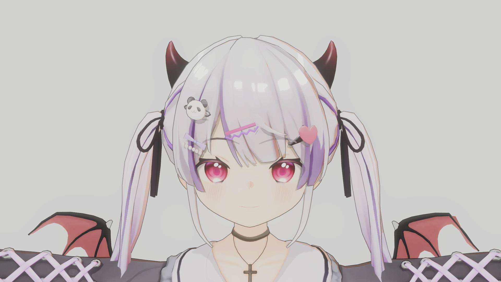
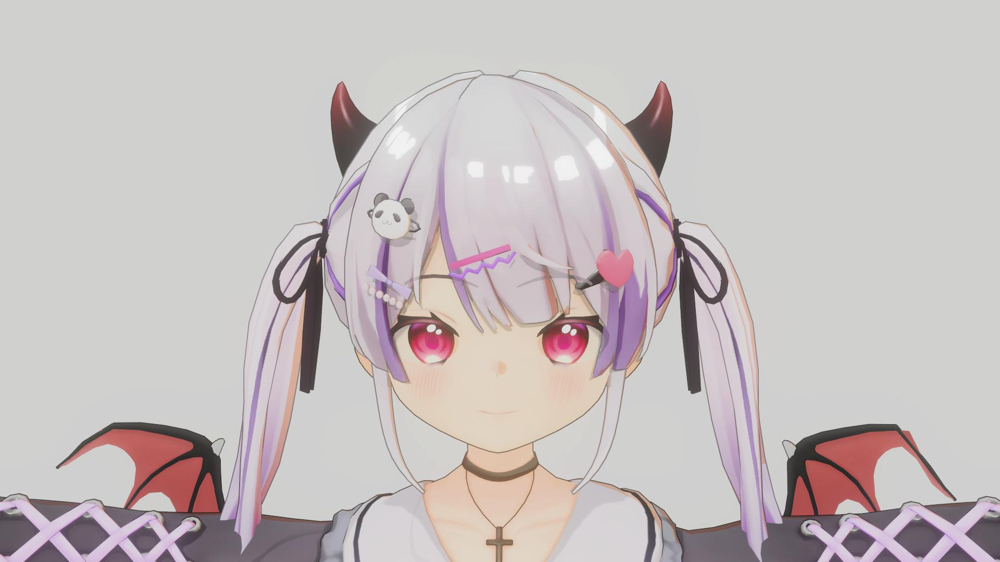
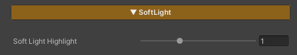

## Soft Light

  

    
  

  

    
  

  

  
SoftLight : 0

  
SoftLight : 1

This feature applies a **Soft Light color adjustment (blend mode / tone curve)** to the character’s color **after lighting has been calculated** (Final Lit Color).

It enhances contrast and smoothness for a more subtle, softer look, and is applied **only to the character’s material**, without affecting the scene’s post-processing.

### Parameters

- **Soft Light Highlight** : Controls the strength of the effect by blending between the original color and the Soft Light result

---
