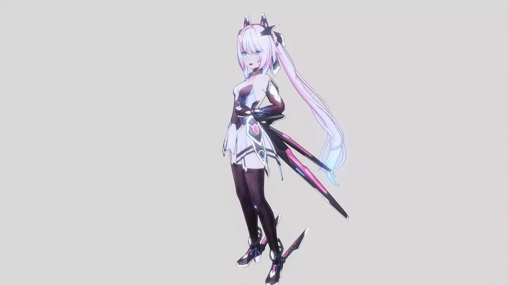
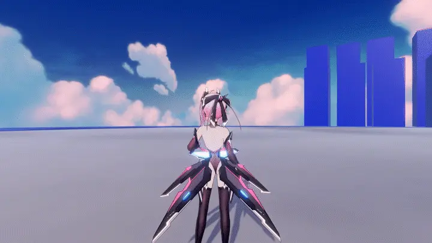
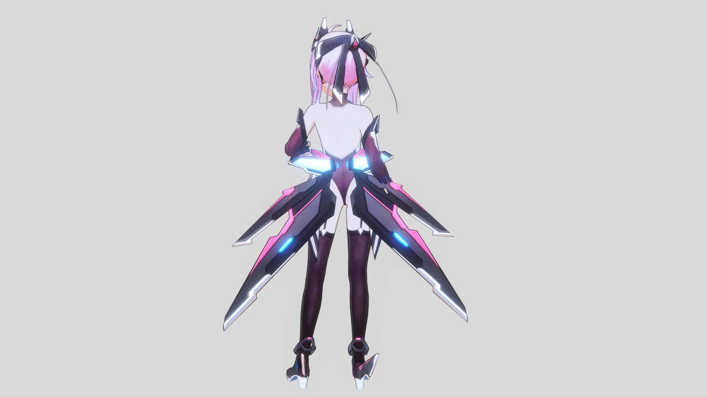
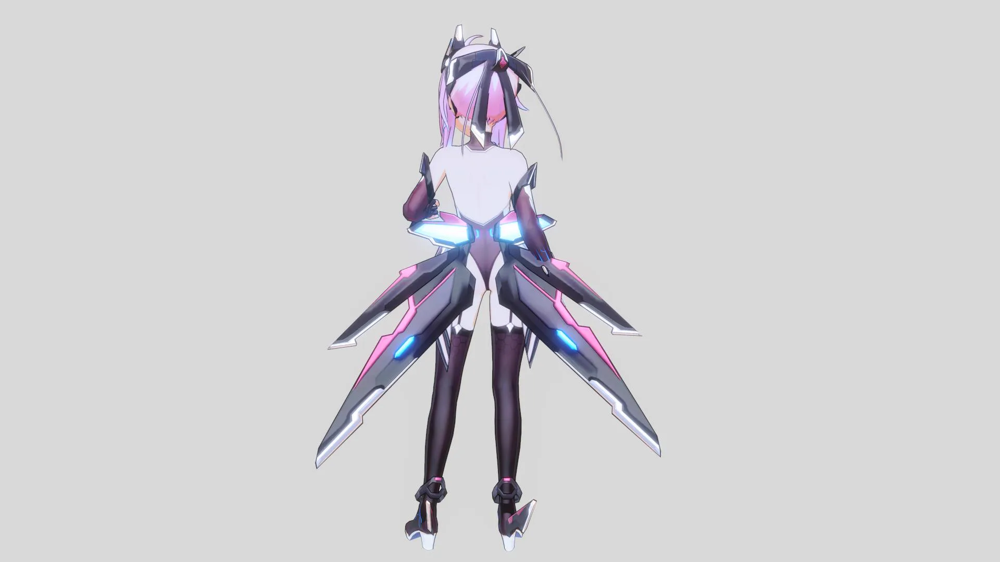
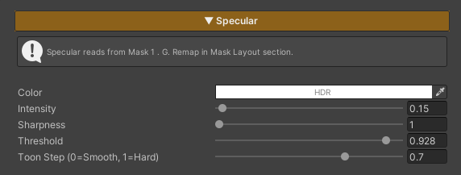

## Specular

---

### Compare Specular On/ Off

  

    
  

  

    
  

  

  
Specular Off

  
Specular On

---

### Usage

Specular is a reflected light effect that appears on a surface when the view direction and light direction align, creating visible highlights on materials such as hair, metal, or plastic.

### Parameter

- **Color (HDR)** : Controls the color of the specular highlight
- **Intensity** : Controls the overall brightness of the specular
- **Sharpness** : Controls the size of the highlight
- **Threshold** : Limits the specular to the brightest areas
- **Toon Step** : Controls the sharpness of the specular edge

---
