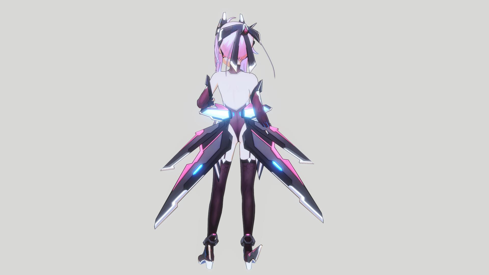
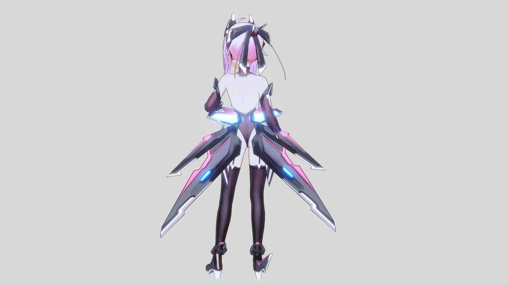

## Specular

---

### Compare Specular On/ Off

  

    
  

  

    
  

  

  
Specular Off

  
Specular On

---

### Usage

Specular is a reflected light effect that appears on a surface when the view direction and light direction align, creating visible highlights on materials such as hair, metal, or plastic.

### Parameter

- **Color (HDR)** : สีของ Specular
- **Intensity** : ความสว่างของ Specular ทั้งก้อน
- **Sharpness** : ควบคุมความแคบ/กว้างของ Highlight
- **Threshold** : บีบ Specular ให้แสดงผลในจุดที่สว่างที่สุด
- **Toon Step** : ความคมของ Specular

---
