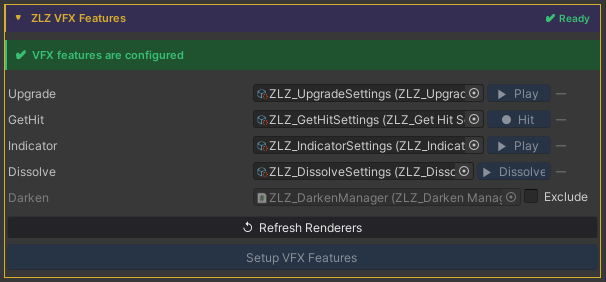
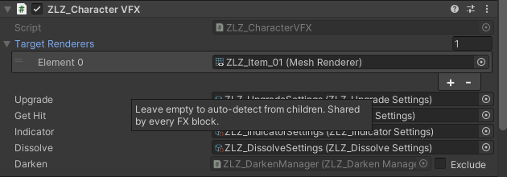
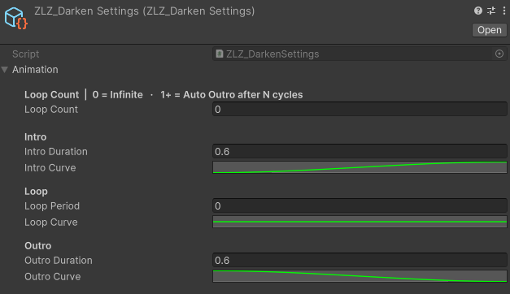

## Target-Darken FX Runtine

### Demo Target-Darken Runtime


---

### Auto Setup

Done in a single step, just click Setup VFX Features and Refresh Renderers.





Adjust Animation Curve



---

### Usage


**Target Darken** is a feature used to reduce the brightness of selected characters in order to draw attention to specific ones, such as characters using skills, appearing in cutscenes, or highlighted during important moments in a scene.

### Concept

The Target Darken system separates control into two levels:

- **Global** : Enables or disables Darken mode for all characters in the scene
- **Local** : Determines whether each individual character is affected by Darken

> Overall concept
> 
> - **Global =** Enables Darken mode for the entire scene
> - **Local =** Selects which characters are *not* darkened

### Parameters

- **TargetDarkenIntensity** **:** Controls how dark the character becomes
    
    > Lower values → the character appears darker
    > 
- **TargetDarkenLocal** **:** Controls whether an individual character is affected by Darken
    - `0` = Not darkened (remains fully lit)
    - `1` = Darkened
- **_TargetDarkenGlobal** : A property intended for developer-side control
    - Not exposed in the Inspector
    - Used to switch all characters into Darken mode simultaneously

### A test script is provided for evaluation

1. Enable the **Target Darken** feature in the character’s material
    - Set `TargetDarkenLocal = 1` → the character can be darkened
    - Set `TargetDarkenLocal = 0` → the character will not be darkened
2. Create an Empty GameObject and attach the script
    
    `Assets/ZLZ_AnimeShader/Demo/Scripts/ZLZ_GlobalDarkenController.cs`
3. Test by adjusting the Global Darken value in the script (0 = normal brightness / 1 = darkened)

---

### Scripting

Target Darken has two layers, a scene-wide controller animates the global value, and each character can opt out to stay bright.  
  
Global control (scene-wide)  Add using ZLZ.AnimeShader; and access the manager via its static Instance:  

> // Animated (recommended) - plays Intro → Loop → Outro  
> ZLZ_DarkenManager.Instance.Darken();  
> ZLZ_DarkenManager.Instance.Restore();  
> ZLZ_DarkenManager.Instance.ToggleDarken();  
> ZLZ_DarkenManager.Instance.SetInstant(0.5f);   // direct value (no animation)  
>   
> // Check state  
> bool active = ZLZ_DarkenManager.Instance.IsActive();  
> Per-character control (opt out of global)  
> Get a reference to ZLZ_CharacterVFX, then access the Darken block:  
>   
> // Stay bright when global darken is active (local = 0)  
> vfx.Darken.Exclude();  
> vfx.Darken.Include();             // follow global again (default)  
> vfx.Darken.SetExcluded(true);     // direct boolean  
>   
> // Check state  
> bool excluded = vfx.Darken.IsExcluded;  
  
Example - toggle global darken from a button:  
  
> void OnDimButtonClicked()  
> {  
>     ZLZ_DarkenManager.Instance.ToggleDarken();  
> }  
  
Example - cinematic spotlight on a boss (everyone else darkens):  

```
void OnBossAppear(GameObject boss)  
{  
boss.GetComponent<ZLZ_CharacterVFX>()?.Darken.Exclude();  
    ZLZ_DarkenManager.Instance.Darken();  
}  
 
void OnBossDefeated(GameObject boss)  
{  
    ZLZ_DarkenManager.Instance.Restore();  
    boss.GetComponent<ZLZ_CharacterVFX>()?.Darken.Include();  
}
```
