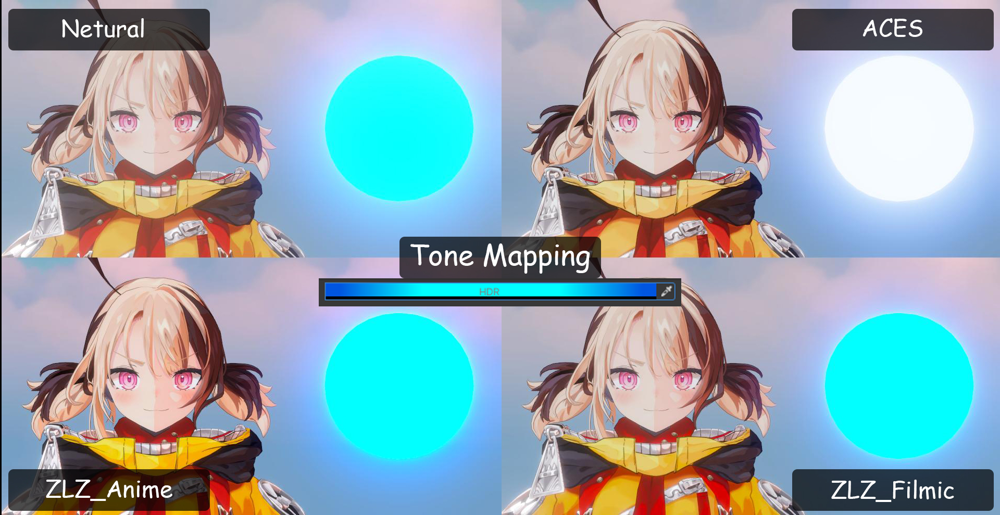
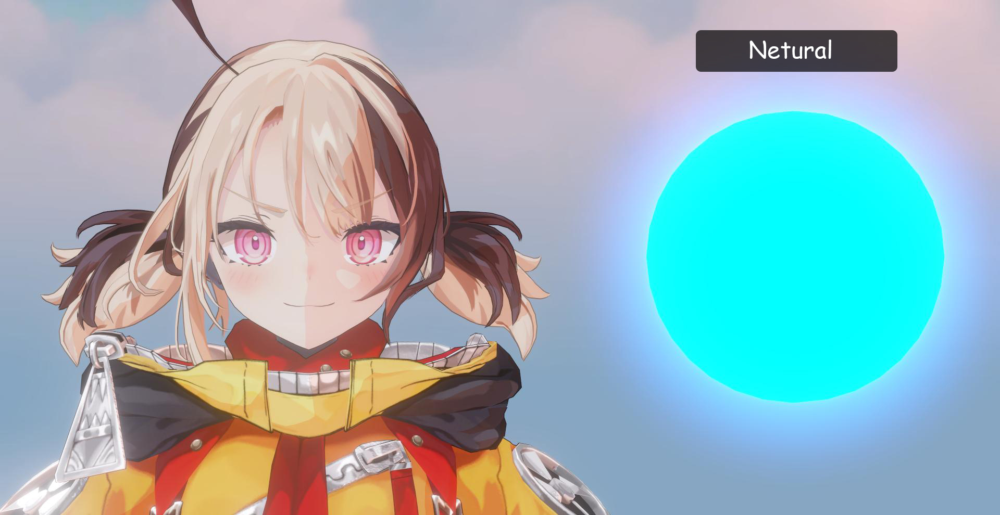
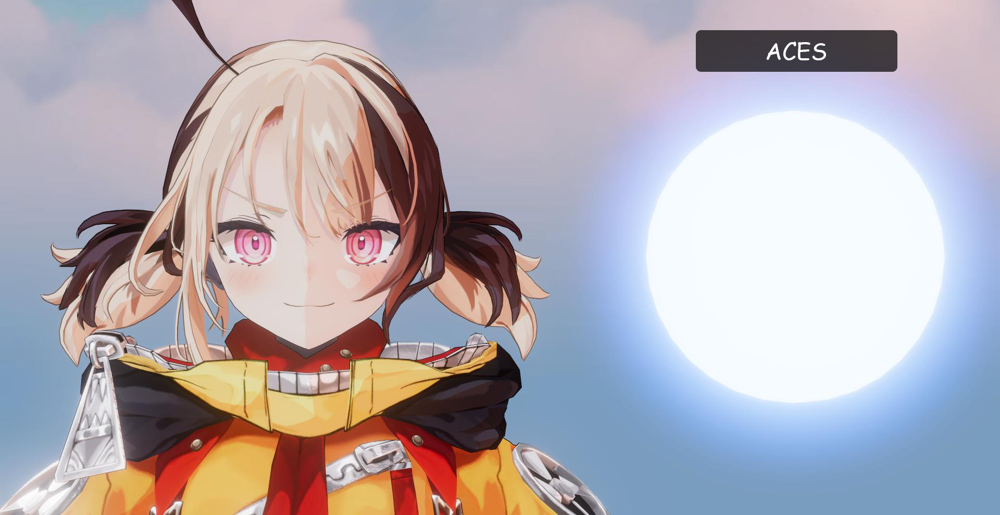
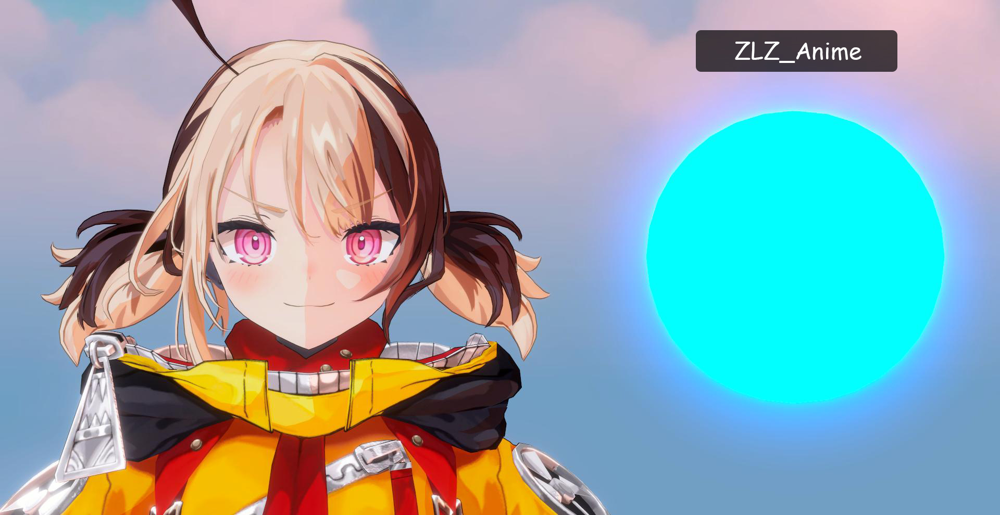

## Tone Mapping

### What is Tone Mapping?

Tone Mapping is the process of adjusting the brightness of an image so it can be properly displayed on screen.

---

### What does Tone Mapping actually fix?

Tone Mapping is not just about “reducing brightness”
It is about reshaping how light behaves across the entire image

What Tone Mapping controls:
- How quickly highlights turn white
- How deep shadows appear
- Whether colors are preserved or desaturated
- The overall contrast of the image

---

### Built-in Tone Mapping vs ZLZ Tone Mapping

By default, Unity provides two main tone mapping options: Neutral and ACES

### Neutral

Neutral tone mapping is designed to preserve the original color response as much as possible.

Characteristics:
- Preserves color relatively well in high-intensity areas
- Produces a softer, slightly washed-out look
- Lower contrast, which can make the image feel less sharp or slightly dull

### ACES

ACES is designed to produce a more cinematic and physically-inspired result.

Characteristics:
- Higher contrast with a strong cinematic look
- Highlights tend to shift toward white under intense lighting
- Shadows can become overly dark (crushed)
- Very bright areas may appear too intense or lose detail

---

### ZLZ Tone Mapping
ZLZ Tone Mapping provides two curve options:

### 1. Anime Curve (Recommended)

Designed to preserve the visual quality of Anime-style rendering

Key features:
- Maintains a sharp and well-defined image
- Preserves color even in high-intensity lighting
- Enhances color vibrancy for a more appealing look
- Highlights do not turn white too quickly or too aggressively
- Shadows remain readable and do not become overly crushed

### 2. Filmic Curve

Designed for a more cinematic and natural-looking result

Key features:
- Produces a smoother and more balanced image (less flat than Neutral)
- Preserves color better than ACES in bright areas
- Colors look good but are less saturated than Anime Curve
- Highlights are controlled and do not blow out too quickly
- Shadows remain softer and more natural

---

### Setup Tone Mapping

1. Go to Project Settings > Quality, Under Render Pipeline Asset, select the active URP Asset  
2. Select the Universal Renderer Data, then add the ZLZ Anime ToneMapping feature.  
3. Create a Global Volume and add ZLZ Anime ToneMapping and Bloom overrides.

---
