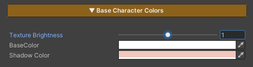

## Tone Mapping

### What is Tone Mapping?

Tone Mapping is the process of converting high dynamic range (HDR) lighting values from the game into a range that a display can actually show (LDR).
In Unity and modern rendering engines, lighting calculations can exceed a value of 1.0, for example:

- Sunlight
- Emissive materials
- Strong highlights from materials

However, real displays can only represent values roughly within the 0–1 range.

---

### What does Tone Mapping actually fix?

Tone Mapping is not just about “reducing brightness”
It is about reshaping how light behaves across the entire image

What Tone Mapping controls:
- How quickly highlights turn white
- How deep shadows appear
- Whether colors are preserved or desaturated
- The overall contrast of the image

---

### Built-in Tone Mapping vs ZLZ Tone Mapping

By default, Unity provides two main tone mapping options: Neutral and ACES

### Neutral

Neutral tone mapping is designed to preserve the original color response as much as possible.

Characteristics:
- Preserves color relatively well in high-intensity areas
- Produces a softer, slightly washed-out look
- Lower contrast, which can make the image feel less sharp or slightly dull

### ACES

ACES is designed to produce a more cinematic and physically-inspired result.

Characteristics:
- Higher contrast with a strong cinematic look
- Highlights tend to shift toward white under intense lighting
- Shadows can become overly dark (crushed)
- Very bright areas may appear too intense or lose detail

---

### Why this is not ideal for Anime / Stylized rendering

Most built-in tone mapping solutions are designed for realistic rendering

However, when applied to Anime / Cartoon / Stylized visuals, they often introduce issues:
- Colors that should be vibrant become washed out
- Highlights turn white too quickly
- Skin tones can look unnatural
- Emissive effects become too strong and harder to control

### The idea behind ZLZ Tone Mapping

ZLZ Tone Mapping is designed specifically for stylized rendering workflows
- Instead of mimicking real-world lighting
- it focuses on preserving the intended Anime look

---

### ZLZ Tone Mapping
ZLZ Tone Mapping provides two curve options:

### 1. Anime Curve (Recommended)

Designed to preserve the visual quality of Anime-style rendering

Key features:
- Maintains a sharp and well-defined image
- Preserves color even in high-intensity lighting
- Enhances color vibrancy for a more appealing look
- Highlights do not turn white too quickly or too aggressively
- Shadows remain readable and do not become overly crushed

### 2. Filmic Curve

Designed for a more cinematic and natural-looking result

Key features:
- Produces a smoother and more balanced image (less flat than Neutral)
- Preserves color better than ACES in bright areas
- Colors look good but are less saturated than Anime Curve
- Highlights are controlled and do not blow out too quickly
- Shadows remain softer and more natural

This section is used to adjust the character’s base color tones. It is designed to allow direct visual tuning through the material, without the need to repeatedly modify texture assets.

### Parameters

- **Texture Brightness :** Adjusts the brightness of the main texture
- **Base Color :** Controls the overall color tone of the character
- **Shadow Color :** Adjusts the color and intensity of shadows to control the character’s mood and contrast

---
