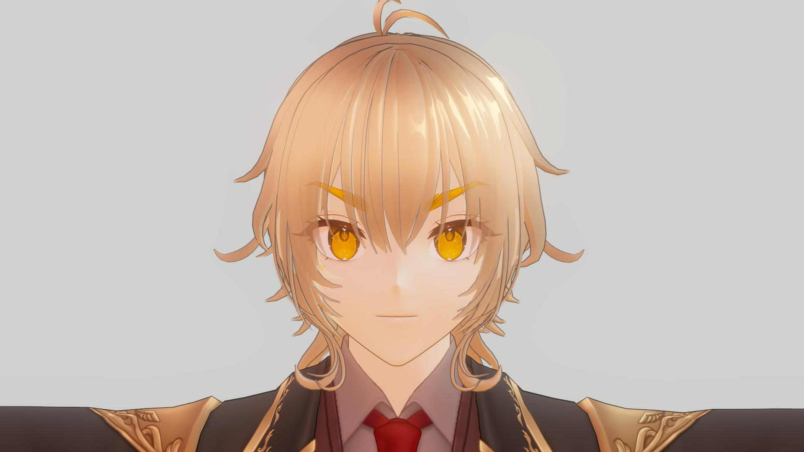
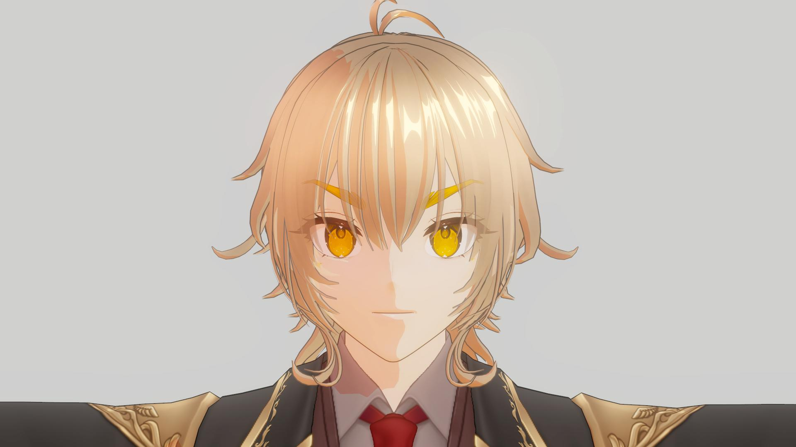
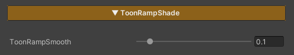

---
layout: docs
title: ToonRampShade
last_modified_at: 2026-04-24
---

## ToonRampShade

  

    
  

  

    
  

  

  
ToonRampSmooth : 1

  
ToonRampSmooth : 0

- Used to control the sharpness of light and shadow edges in a toon style
- Lower values produce sharper, harder lighting edges
- Higher values result in smoother, more gradual light transitions

