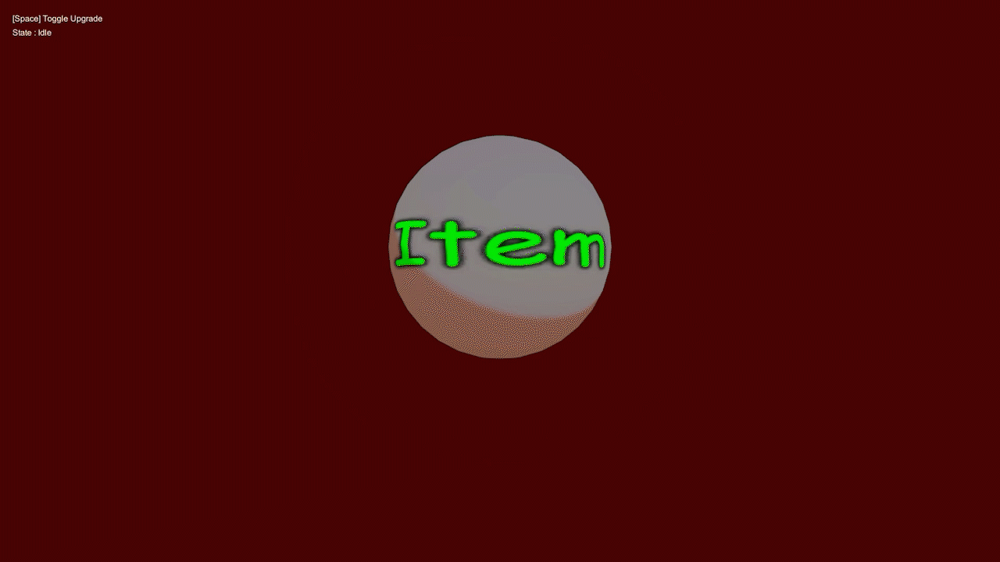

## Upgrade

### Demo Upgrade Runtime

### Auto Setup

**Upgrade** is a feature used to visualize when a character or weapon is upgraded, providing clear visual feedback to convey progression and change to the player.

### Parameters

- **UpgradeActive :** Enables or disables the effect *(0 = off / 1 = on)*
- **Upgrade Color :** Sets the color of the effect when an upgrade occurs
- **Upgrade Intensity :** Controls the brightness of the effect
    
    *(higher values make the effect more pronounced)*
    
- **Upgrade Min Brightness :** Controls the minimum brightness of the effect
    
    *(higher values make the effect more visible / lower values reduce brightness, allowing the main texture to remain more visible)*
