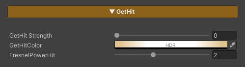
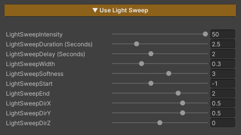
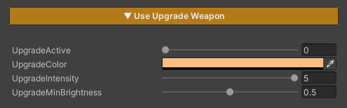

# Character FX

[Video ZLZ Anime Shader – CharacterFX System & Overview](https://youtu.be/hImKw7_LWJ4)

## Emissive

Emissive is used to add light to specific areas of the character, making them appear glowing or visually prominent. It is suitable for elements such as gems, eyes, or special effects on the character.

This feature controls its active area through the

**Feature Mask (Blue Channel)**.  

If no mask is defined in this channel, the Emissive effect will not be applied.

### Parameters

- **Emissive Color :** Adjusts the color of the emissive effect
- **Emissive Intensity :** Controls the brightness of the emissive effect

---

## Dissolve Character

Dissolve Character is used to gradually fade a character out of the scene. It is commonly applied when a character dies, warps, or is removed from the scene. The effect allows flexible control over the pattern, color, and timing of the dissolve.

### Parameters

- **Texture2DDissolve :** Uses a noise texture to define the dissolve pattern. *Tiling* can be adjusted to achieve the desired look
- **Dissolve Color :** Adjusts the color of the glow displayed along the dissolve edges
- **Dissolve Value :** Controls the dissolve state *(0 = disabled / 1 = fully dissolved and invisible)*
- **Start Dissolve :** Adjusts the starting point of the dissolve effect. *Lower this value if the effect starts too quickly or appears abrupt; increase it if the effect starts too late*
- **End Dissolve :** Adjusts the ending point of the dissolve effect. *Used to fix cases where the character is still partially visible when Dissolve Value reaches 1, or disappears too quickly*
- **SizeGlowDissolve :** Controls the size of the glow edge displayed during the dissolve

---

## Target Darken

**Target Darken** is a feature used to reduce the brightness of selected characters in order to draw attention to specific ones, such as characters using skills, appearing in cutscenes, or highlighted during important moments in a scene.

### Concept

The Target Darken system separates control into two levels:

- **Global** : Enables or disables Darken mode for all characters in the scene
- **Local** : Determines whether each individual character is affected by Darken

> Overall concept
> 
> - **Global =** Enables Darken mode for the entire scene
> - **Local =** Selects which characters are *not* darkened

### Parameters

- **TargetDarkenIntensity** **:** Controls how dark the character becomes
    
    > Lower values → the character appears darker
    > 
- **TargetDarkenLocal** **:** Controls whether an individual character is affected by Darken
    - `0` = Not darkened (remains fully lit)
    - `1` = Darkened
- **_TargetDarkenGlobal** : A property intended for developer-side control
    - Not exposed in the Inspector
    - Used to switch all characters into Darken mode simultaneously

### A test script is provided for evaluation

1. Enable the **Target Darken** feature in the character’s material
    - Set `TargetDarkenLocal = 1` → the character can be darkened
    - Set `TargetDarkenLocal = 0` → the character will not be darkened
2. Create an Empty GameObject and attach the script
    
    `Assets/ZLZ_AnimeShader/Demo/Scripts/ZLZ_GlobalDarkenController.cs`
    
3. Test by adjusting the Global Darken value in the script (0 = normal brightness / 1 = darkened)

---

## Indicator / Target Select

**Indicator / Target Select** is a feature used to highlight characters that are currently selected as targets, such as characters being locked onto, selected for attack, or about to be affected by certain skills.

It helps players immediately recognize **“which character is about to be affected and how.”**

### Parameters

- **Indicator Strength :** Controls the Indicator / Target Select effect *(0 = off / 1 = on)*
- **Indicator Color :** Adjusts the color applied to the character affected by Indicator / Target Select
- **FreshnelPowerIndicator :** Controls the position and width of the edge effect around the character *(higher values bring the effect closer to the silhouette edge)*

---

## GetHit

**Get Hit** is a feature used to visualize when a character is attacked, providing immediate visual feedback so players can clearly recognize that a hit has occurred.

### Parameters

- **GetHit Strength :** Controls the Get Hit effect (0 = off / 1 = on)
- **GetHit Color :** Adjusts the color applied to the character when Get Hit is triggered
- **FreshnelPowerHit :** Controls the position and width of the edge effect around the character

*(higher values bring the effect closer to the silhouette edge)*

---

## LightSweep

**Light Sweep** is a feature that adds a moving light effect sweeping across an object.

It is used to **showcase equipment or important elements**, such as weapons, high-tier items, characters during upgrades, or special moments.

When this feature is enabled, the effect plays immediately and runs in a continuous loop based on the configured values.

### Parameters

- **LightSweepIntensity :** Controls the brightness of the light sweep
    
    *(higher values make the light more pronounced)*
    
- **LightSweepDuration :** Duration of one sweep cycle *(seconds)*
- **LightSweepDelay :** Delay after one cycle ends before the next cycle starts *(seconds)*
- **LightSweepWidth :** Width of the light sweeping across the object
    
    *(lower values = narrower light / higher values = wider light)*
    
- **LightSweepSoftness :** Controls the sharpness of the light edges
    
    *(lower values = sharper edges / higher values = softer edges)*
    
- **LightSweepStart :** Starting point of the Light Sweep
- **LightSweepEnd :** Ending point of the Light Sweep
- **LightSweepDirX :** Controls the sweep direction on the X axis *(1 = right → left / -1 = left → right)*
- **LightSweepDirY :** Controls the sweep direction on the Y axis
(1 = top → bottom / -1 = bottom → top)
- **LightSweepDirZ :** Controls the sweep direction on the Z axis
    
    *(1 = back → front / -1 = front → back)*
    

> Light Sweep directions can be combined.

**For example:**
`LightSweepDirX = 1` and `LightSweepDirY = 1` will result in a diagonal sweep toward the upper-right direction.
> 

---

## Upgrade

**Upgrade** is a feature used to visualize when a character or weapon is upgraded, providing clear visual feedback to convey progression and change to the player.

### Parameters

- **UpgradeActive :** Enables or disables the effect *(0 = off / 1 = on)*
- **Upgrade Color :** Sets the color of the effect when an upgrade occurs
- **Upgrade Intensity :** Controls the brightness of the effect
    
    *(higher values make the effect more pronounced)*
    
- **Upgrade Min Brightness :** Controls the minimum brightness of the effect
    
    *(higher values make the effect more visible / lower values reduce brightness, allowing the main texture to remain more visible)*
