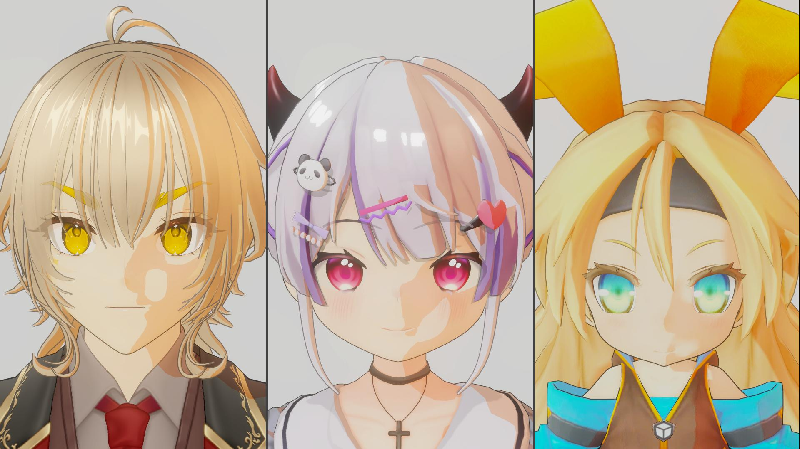
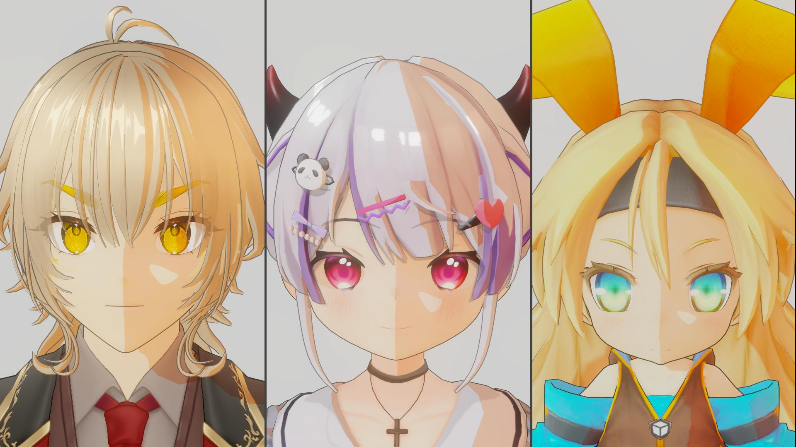
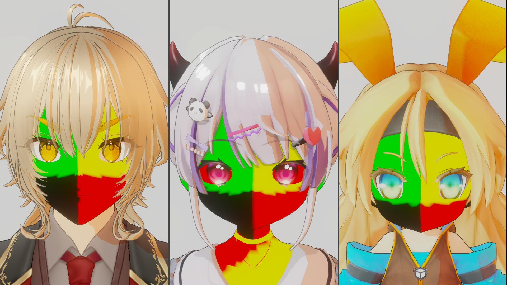
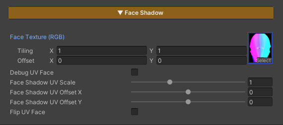

---
layout: docs
title: FaceShadow
last_modified_at: 2026-04-20
---

# Face Shadow

  

    
  

  

    
  

  

  
FaceShadow Off

  
FaceShadow On

  

    
  

  

    
  

  

  
Correct Face UV (Debug)

  
FaceShadow On



Face Shadow is designed to be flexible and works with a wide variety of characters, regardless of how their face UVs are set up.  
It also includes a Face Shadow Paint texture that can be reused across multiple characters, so you don’t need to switch textures frequently.

### Parameters

- **Face Texture** : Assign a texture to define lighting and shadow on the face
- **Debug UV Face** : Enable this to set up or check the face UV on your character
- **Face Shadow UV Scale** : Adjust the scale to make it larger or smaller
- **Face Shadow UV Offset X** : Adjust the offset on the X axis to align it correctly
- **Face Shadow UV Offset Y** : Adjust the offset on the Y axis to align it correctly
- **Flip UV Face** : Used to flip the UV on the Y axis in case the UV is upside down

