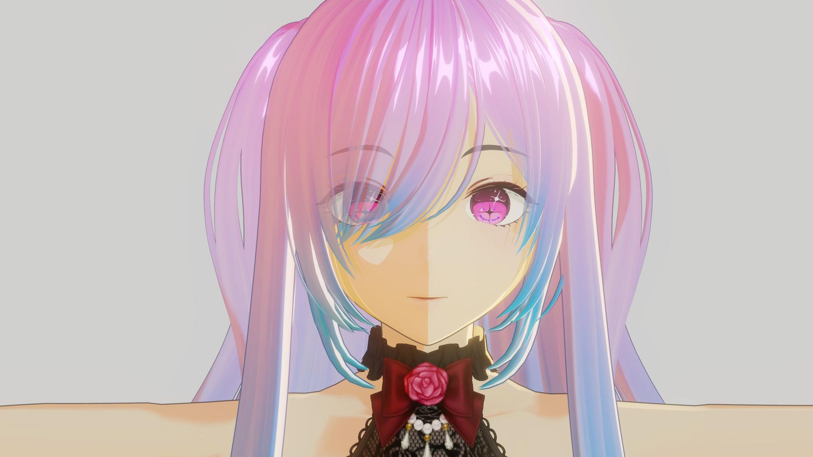
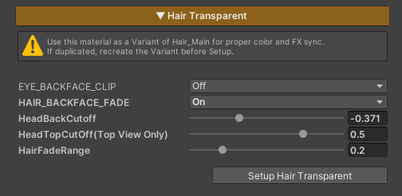
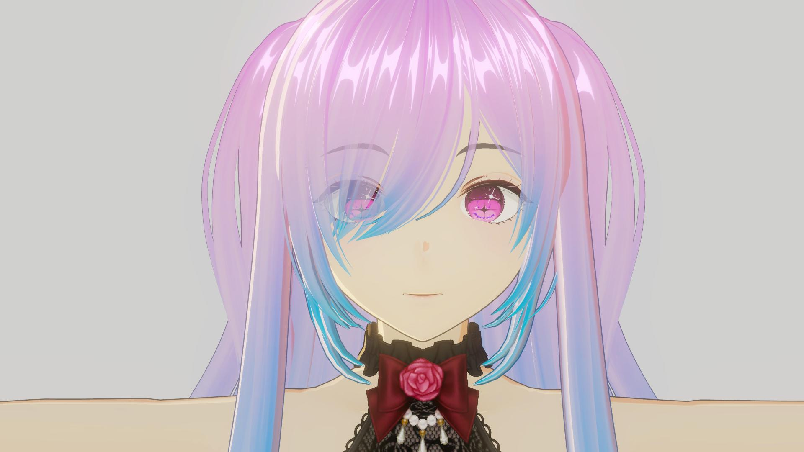
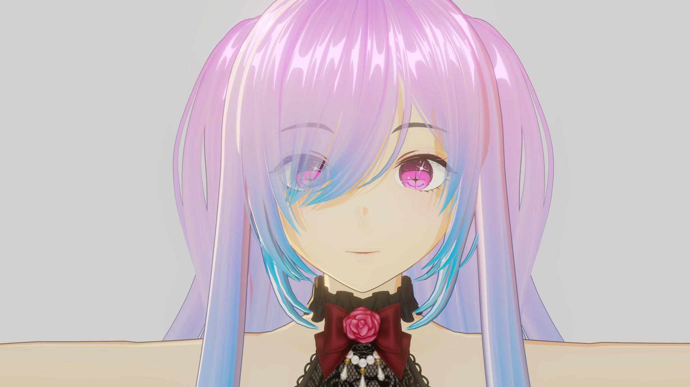
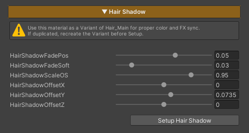

# Hair System



---

# Hair Transparent

  

    
  

  

    
  

  

  
Hair Transparent Off

  
Hair Transparent On

This feature is designed to be used exclusively with the hair Transparent material
(ZLZ_Char_Hair_Transparent_Variant)

This system simplifies the setup of transparent hair rendering by **fading hair at the character’s side angles based on the camera position** and **clipping certain facial elements when the camera is positioned behind the character**, helping to avoid unwanted visual artifacts.

### Parameters

- **Setup Hair Transparent (Button)** : Performs the entire setup process instantly with a single click
- **EYE_BACKFACE_CLIP :** Clips meshes using ZLZ_Adv_Char_Face_Reveal & ZLZ_Adv_Char_Hair_Shadow_VariantFromMain when the camera is behind the character
- **HAIR_BACKFACE_FADE :** Fades hair using ZLZ_Adv_Char_Hair_Transparent_VariantFromMain when the camera is behind the character
- **HeadBackCutoff :** Adjusts the side cutoff position for EYE_BACKFACE_CLIP
- **HeadTopCutOff (Top View Only) :** Adjusts the top cutoff position for EYE_BACKFACE_CLIP
- **HairFadeRange :** Controls the softness of the hair fade for HAIR_BACKFACE_FADE

---

# Hair Shadow

  

    
  

  

    
  

  

  
Hair Shadow Off

  
Hair Shadow On

This feature is designed to be used exclusively with the hair shadow material
(ZLZ_Adv_Char_Hair_Shadow_VariantFromMain)

The system **scales and offsets the hair shadow mesh** to generate shadows behind the actual hair, allowing precise control over the position, shape, and coverage of the hair shadows. It also lets you define which areas of the hair should display the shadow mesh.

Traditionally, setting up this type of hair shadow system requires multiple steps and fine adjustments. To simplify the workflow, we provide a **one-click setup** that automatically configures the material for you.

After the initial setup, you may fine-tune the **Scale and Offset** values to better match the proportions and hairstyle of each individual character.

### Parameters

- **Setup Hair Shadow (Button)** : Performs the entire setup process with a single click
- **HairShadowFadePos :** Controls where the hair shadow appears
- **HairShadowFadeSoft :** Adjusts the softness of the hair shadow fade
- **HairShadowScaleOS :** Scales the hair shadow mesh
- **HairShadowOffsetX :** Offsets the hair shadow mesh along the X axis (left / right)
- **HairShadowOffsetY :** Offsets the hair shadow mesh along the Y axis (up / down)
- **HairShadowOffsetZ :** Offsets the hair shadow mesh along the Z axis (front / back)
