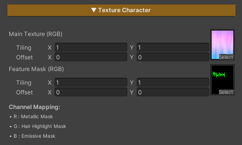

# Features

[Hair System](./hair-system/)

[Lighting System](./lighting-system/)

[Surface & Stylization](./surface-stylization/)

[Character FX](./character-fx/)

# Features

The features of this shader are designed to be divided into **two main groups**, based on their roles and impact on performance.

### 1. Locked Features

These features form the core systems of the shader and are designed to be **always enabled**.

- They provide the fundamental structure required for the shader to function
- They cannot be disabled
- Enabling these features does not impact performance

### 2. On / Off Features

These features are optional, allowing users to enable or disable them as needed.

- They can be toggled on or off through the material
- When disabled, the system removes the related calculations entirely, helping maintain appropriate shader performance
- Features in this group cannot be toggled at runtime and should be configured during setup or before use

---

## Texture Character

This shader uses **two main types of textures**, as described below:

### 1. Main Texture (RGBA)

The primary texture used for rendering the character’s surface.

### Parameters

- **RGB (Red, Green, Blue) :** Defines the character’s base color
- **A (Alpha) :** Controls the character’s transparency; darker masked areas become more transparent

### 2. Feature Mask (RGB)

A texture used to control the operating areas of various features by masking each channel.

### Parameters

- **R (Red) :** Defines where the **Metallic** feature is applied
- **G (Green) :** Defines where the **Hair Highlight** feature is applied
- **B (Blue) :** Defines where the **Emissive** feature is applied

> Some features may affect the whole character or not work as expected.
> 

---
