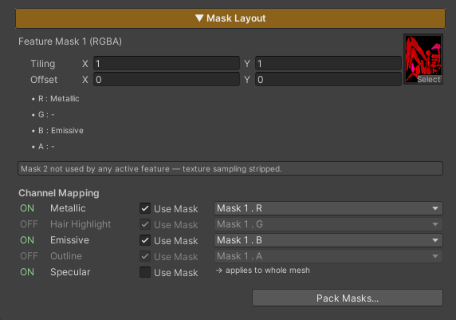
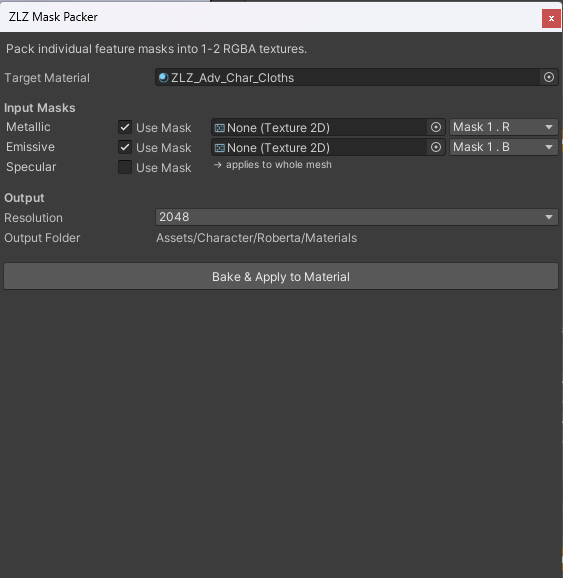

# Features

The features of this shader are designed to be divided into **two main groups**, based on their roles and impact on performance.

### 1. Locked Features

These features form the core systems of the shader and are designed to be **always enabled**.

- They provide the fundamental structure required for the shader to function
- They cannot be disabled
- Enabling these features does not impact performance

### 2. On / Off Features

These features are optional, allowing users to enable or disable them as needed.

- They can be toggled on or off through the material
- When disabled, the system removes the related calculations entirely, helping maintain appropriate shader performance
- Features in this group cannot be toggled at runtime and should be configured during setup or before use

---

## Texture Character

This shader uses **two main types of textures**, as described below:

### Main Texture (RGBA)

The primary texture used for rendering the character’s surface.

### Parameters

- **RGB (Red, Green, Blue) :** Defines the character’s base color
- **A (Alpha) :** Controls the character’s transparency; darker masked areas become more transparent

---

## Mask Layout (Update in v 1.5.0)

A mask texture management system for ZLZ Anime Shader, packs masks for multiple features into a single texture to save VRAM and reduce texture samples

### Feature Mask (RGBA)

A texture used to control the operating areas of various features by masking each channel.

### Concept

- One texture has 4 channels (R/G/B/A) → 1 channel = 1 feature mask → 1 texture supports 4 features.
- ZLZ Anime Shader supports up to 2 mask textures = 8 features total.

### Default Layout:
- Mask 1: R = Metallic, G = Hair Highlight, B = Emissive, A = Outline
- Mask 2: R = Specular

### How to Use

Each feature has a "Use Mask" checkbox:
- ✓ Checked : Reads mask from the selected channel → feature applies according to the mask
- ☐ Unchecked : 	Feature applies to the whole mesh → no texture needed

> You can change each feature's dropdown to point to a different channel if you want to design your own layout,  
> if any feature crosses into Mask 2, the Mask 2 slot appears automatically.  

---

## ZLZ Mask Packer (Update in v 1.5.0)

A tool that bakes individual mask textures into a packed RGBA texture automatically — no need to open Photoshop to combine channels manually.

### How to Open
- Click the "Pack Masks..." button in Mask Layout (Material Inspector)
- Or from menu: Window > ZLZ > Mask Packer

### How to Use
1. Select a Target Material
2. The tool shows only features that are enabled on the material
3. For each feature:
- ✓ Use Mask → drop a texture and pick the destination channel
- ☐ Unchecked → do nothing (feature will apply to the whole mesh)
4. Click Bake & Apply to Material

### What the Tool Does Automatically
- Combines textures → creates MaterialName_Mask1.png (and Mask2 if needed) next to the material
- Configures the importer (sRGB Off, Mipmap On)
- Assigns textures back to the material + sets channel mappings + refreshes keywords

### Things to Know
- The tool reads the R channel of each source texture as the mask value (supports both grayscale and color textures)
- If two features target the same channel → a warning appears and Bake is disabled
- Existing Mask1 / Mask2 files will be overwritten
