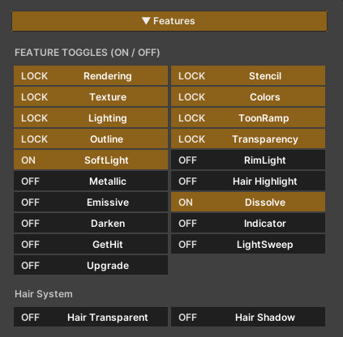
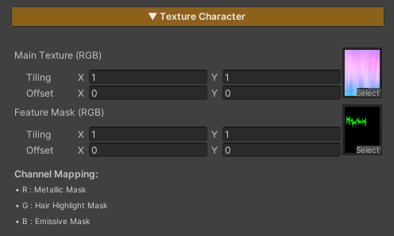
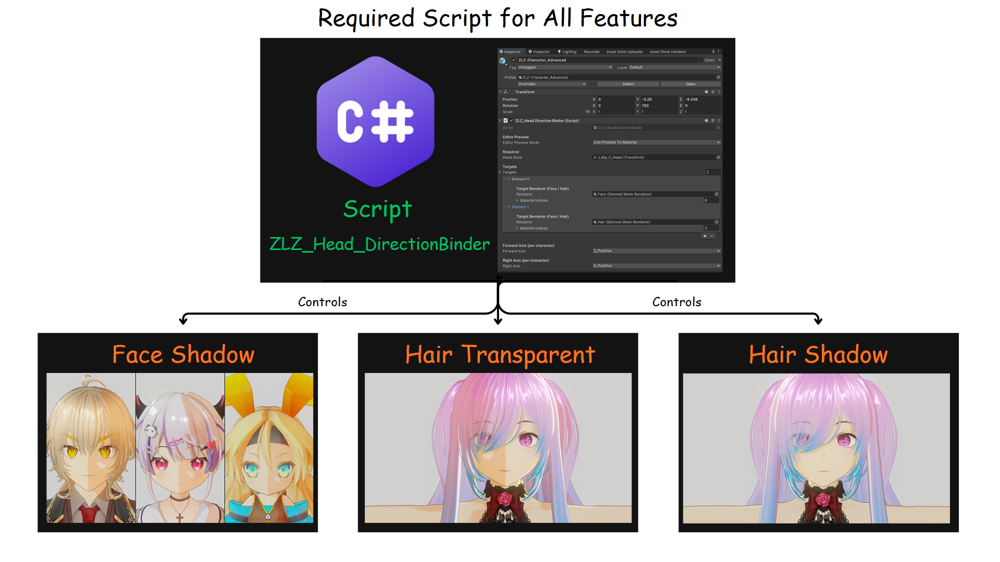

# Features

The features of this shader are designed to be divided into **two main groups**, based on their roles and impact on performance.

### 1. Locked Features

These features form the core systems of the shader and are designed to be **always enabled**.

- They provide the fundamental structure required for the shader to function
- They cannot be disabled
- Enabling these features does not impact performance

### 2. On / Off Features

These features are optional, allowing users to enable or disable them as needed.

- They can be toggled on or off through the material
- When disabled, the system removes the related calculations entirely, helping maintain appropriate shader performance
- Features in this group cannot be toggled at runtime and should be configured during setup or before use

---

## Texture Character

This shader uses **two main types of textures**, as described below:

### 1. Main Texture (RGBA)

The primary texture used for rendering the character’s surface.

### Parameters

- **RGB (Red, Green, Blue) :** Defines the character’s base color
- **A (Alpha) :** Controls the character’s transparency; darker masked areas become more transparent

### 2. Feature Mask (RGB)

A texture used to control the operating areas of various features by masking each channel.

### Parameters

- **R (Red) :** Defines where the **Metallic** feature is applied
- **G (Green) :** Defines where the **Hair Highlight** feature is applied
- **B (Blue) :** Defines where the **Emissive** feature is applied

> Some features may affect the whole character or not work as expected.
> 

---

## ZLZ_HeadDirectionBinder (Required Script)

# Overview
ZLZ_HeadDirectionBinder is the core script used to control the direction of the Head Bone and send that data to the shader, ensuring that related features work correctly.

This script is required for all of the following features:
- Face Shadow
- Hair Transparent
- Hair Shadow

# What does it do
The script reads the position and direction of the Head Bone (in World Space) and passes this data to the material, such as:
- Head Center Position
- Head Forward Direction
- Head Right Direction

These values are then used in the shader to calculate lighting behavior and various visual effects on the face and hair.

# Why This Script Is Required

Features like Face Shadow and Hair Effects cannot rely on mesh data alone to determine correct directions,
because each character may have different axis setups and rig configurations.

Using the Head Bone as a reference helps ensure that:
- Facial shadows align correctly with the actual light direction
- Hair Transparent works properly based on the viewing angle
- Hair Shadow is positioned accurately

# If This Script Is Not Used

Features may not work correctly, such as:
- Face Shadow will not function
- Hair Transparent may render incorrectly (eyes and eyebrows may disappear)
- Hair Shadow will not align with the light direction
