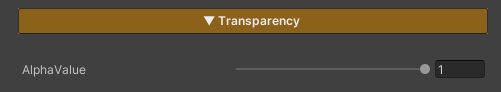

# Surface & Stylization

[Video ZLZ Anime Shader – Surface & Stylization Overview](https://youtu.be/xnA9aQ0pEfE)

## Metallic

Metallic is used for character parts made of metal materials, adding shine and surface depth.

If no **Feature Mask (Red Channel)** is assigned to define the active area, this feature will not be applied.

### Parameters

- **Gradient Metallic :** Uses the `T_Gradient_Metallic` texture to control the metallic reflection behavior. Adjusting Tiling and Offset is not recommended, in order to achieve results as intended by the design
- **MetalNormalMap :** Uses a normal texture to add surface detail to metallic areas. The default texture is `T_Normal`
    - **Lower *Tiling* values** (e.g. 0.05 × 0.05) produce a more toon-style look
    - **Higher *Tiling* values** (e.g. 30 × 30) produce a more semi-realistic look
- **Intensity Metal :** Controls the brightness of the metallic areas

---

## Transparency

### Parameters

- **Alpha Value :** Controls the overall transparency of the entire character, suitable for cases where full character transparency is required

> **Note**
> 
> 
> To control transparency only in specific areas, set the Alpha Channel in the **Main Texture**.
> 
> Areas with lower Alpha values (darker) will appear more transparent,
> 
> while areas with higher Alpha values (brighter) will appear more opaque.
>
