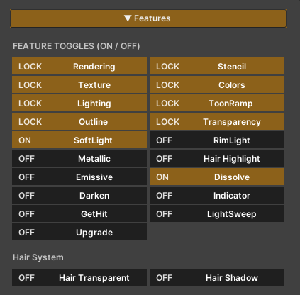

# Performance

Our shader includes a wide range of features, each designed to operate independently. When a feature is enabled or disabled, unused code is **actually stripped at compile time**, ensuring that only the active features are processed.

This means that even though the shader may contain many features, only the ones you choose to enable will be calculated during runtime.

As a result, optimizing the ZLZ Anime Shader is straightforward simply enable only the features you need for your character.

---

## Test Code Stripping by Toggling the Rim Light Feature

When inspecting the fragment shader, you can clearly see that disabled features leave behind neither properties nor any related calculations in the code.

Rim Light On

Rim Light Off

