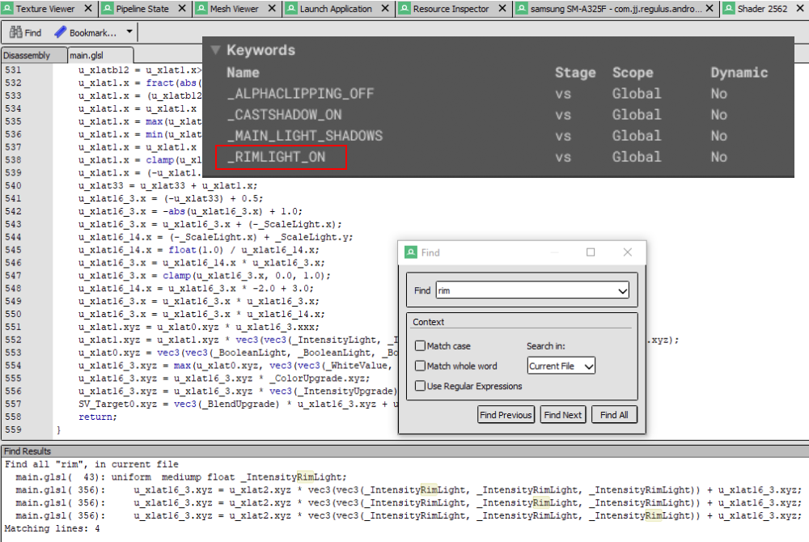
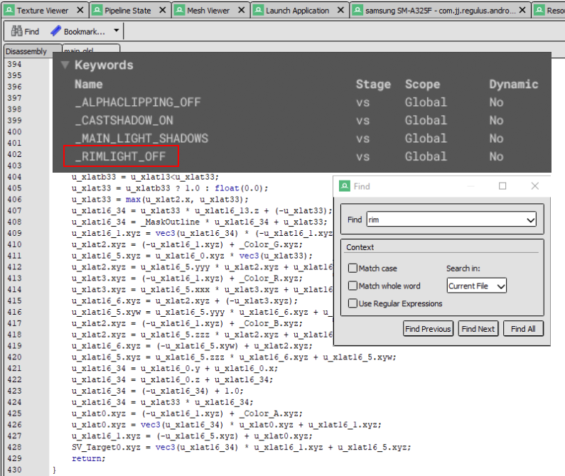
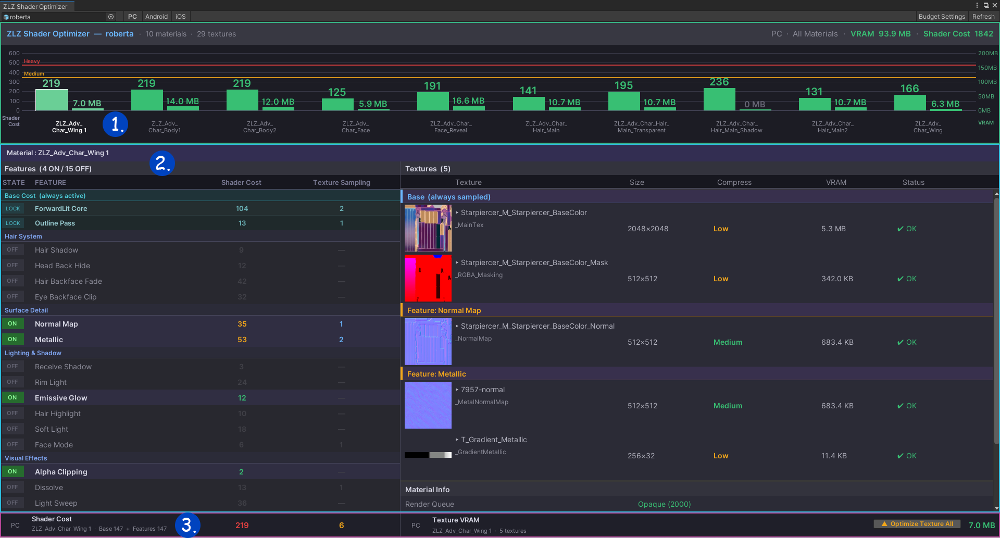
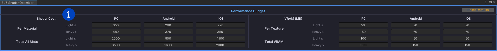
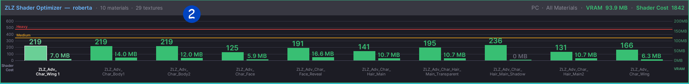
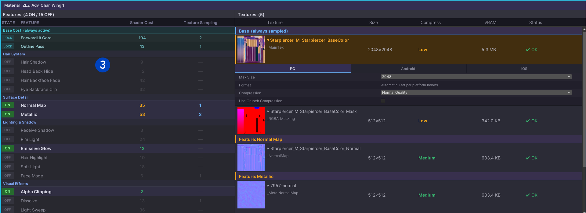

# Performance

Our shader includes a wide range of features, each designed to operate independently. When a feature is enabled or disabled, unused code is **actually stripped at compile time**, ensuring that only the active features are processed.

This means that even though the shader may contain many features, only the ones you choose to enable will be calculated during runtime.

As a result, optimizing the ZLZ Anime Shader is straightforward simply enable only the features you need for your character.

---

## Test Code Stripping by Toggling the Rim Light Feature

When inspecting the fragment shader, you can clearly see that disabled features leave behind neither properties nor any related calculations in the code.

Rim Light On

Rim Light Off

---

## ZLZ Shader Optimizer (New in V 1.4.0)

ZLZ Shader Optimizer was created to help users understand how much resources their character is using,
and make it easier to optimize for different target platforms.

### Understanding ZLZ Shader Optimizer

1.Performance Budget : Acts like a ruler for checking whether a Material is becoming too heavy, or if the overall Character is too expensive.
- Used to define what Shader Cost and VRAM usage should be considered “Light” or “Heavy”
- Supports separate settings for each platform such as PC / Android / iOS
- Values set here are used as reference lines in the Bar Chart from section 2
- Includes default values for beginners
- Users can customize the values to better fit their own project
- Press Reset Defaults to restore the original default values

2.Bar Chart : Used to view the overall resource usage of all Materials in the Character, making it easier to identify which parts are heavy or overusing resources.
- Shader Cost represents how expensive the Shader is when calculating features and effects
- VRAM (MB) represents the amount of memory used by Textures
- The chart displays all Materials together for a clearer overview of the Character
- The colored lines above are based on the Performance Budget settings from section 1
- Makes it easy to quickly identify which Materials are exceeding the budget
- Clicking a Material in the chart will show more detailed information in section 3

3.Material Detail : Displays detailed information about the selected Material.
The left side shows Shader Cost information, while the right side shows Texture information.

Shader Cost : Helps users understand which features are contributing the most to the Material’s Shader Cost.
- Shows how much Shader Cost each feature is using
- Users can enable or disable features to test their impact on performance in real time
- Makes it easier to decide which features should be enabled or disabled for each platform
- Shows whether a feature requires additional Textures

Texture : Used for viewing detailed information about all Textures currently used by the Material.
- Displays the current Texture size
- Displays the Texture Compression status
- Displays the amount of VRAM used by each Texture
- Users can click a Texture to adjust Compression settings directly
- Supports separate platform settings such as PC / Android / iOS
