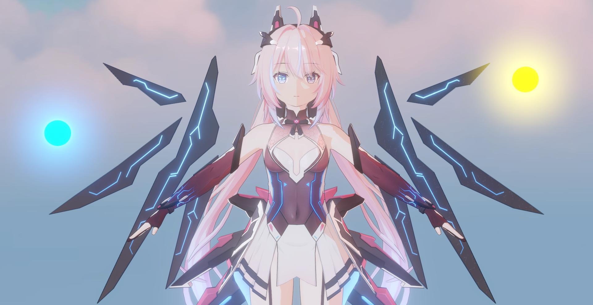
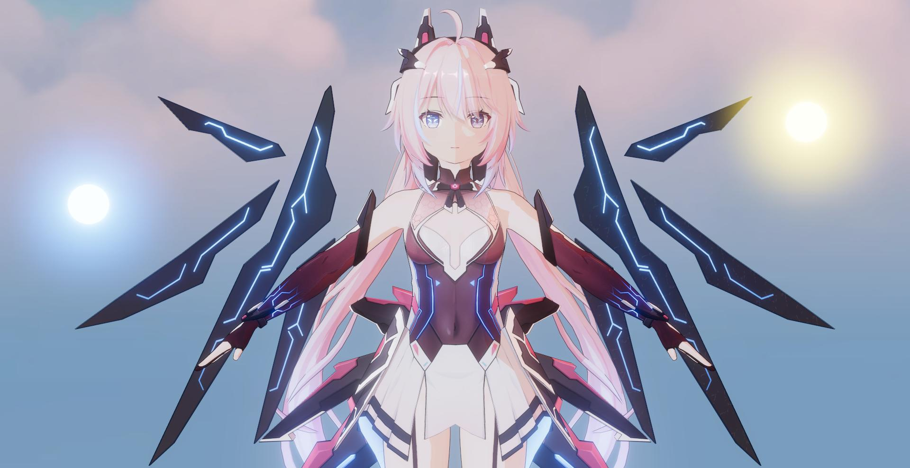
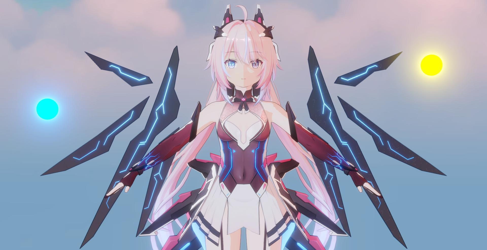
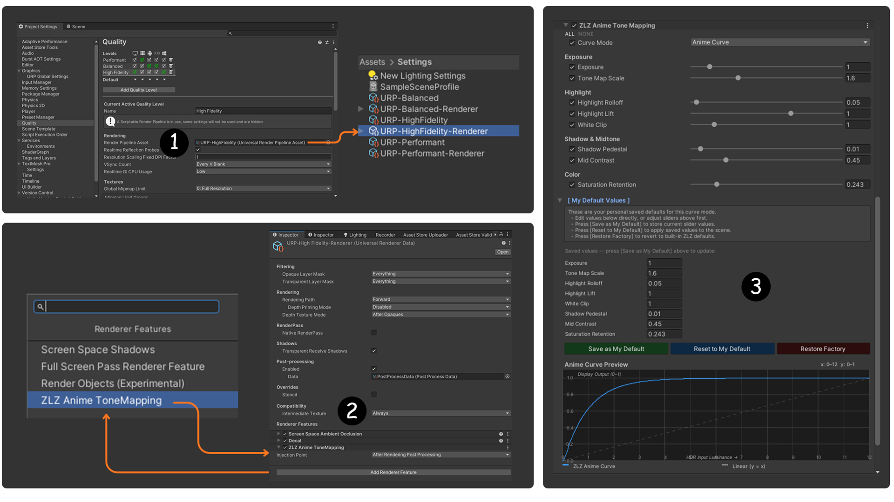
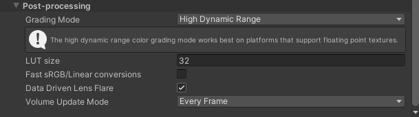
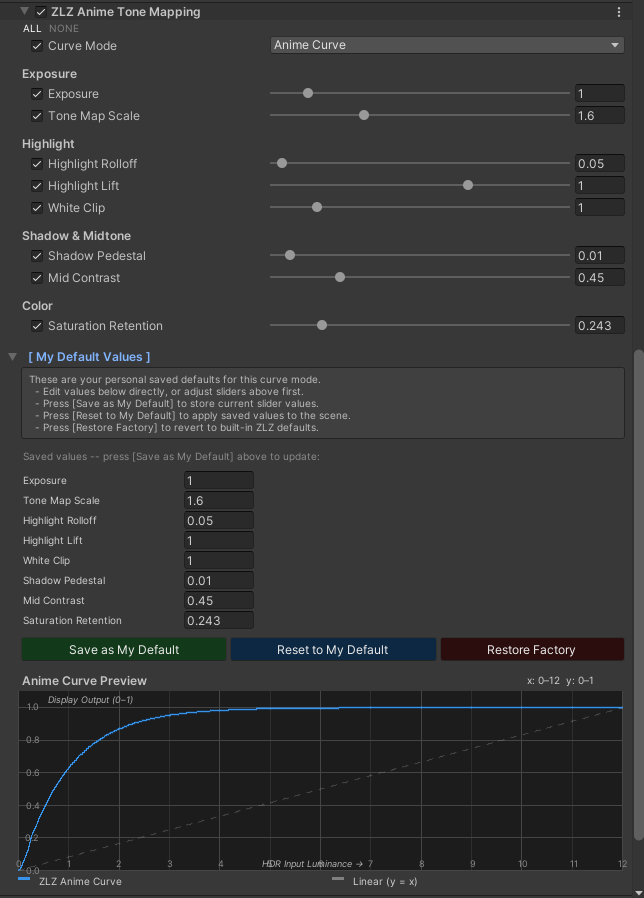
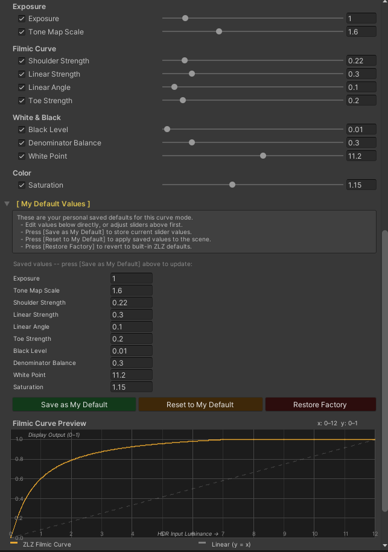

## Tone Mapping (Update in Version 1.3.0)



### What is Tone Mapping?

Tone Mapping is the process of adjusting the brightness of an image so it can be properly displayed on screen.

---

### What does Tone Mapping actually fix?

Tone Mapping is not just about “reducing brightness”
It is about reshaping how light behaves across the entire image

What Tone Mapping controls:
- How quickly highlights turn white
- How deep shadows appear
- Whether colors are preserved or desaturated
- The overall contrast of the image

---

### Built-in Tone Mapping vs ZLZ Tone Mapping

By default, Unity provides two main tone mapping options: Neutral and ACES

### Neutral

Neutral tone mapping is designed to preserve the original color response as much as possible.

Characteristics:
- Preserves color relatively well in high-intensity areas
- Produces a softer, slightly washed-out look
- Lower contrast, which can make the image feel less sharp or slightly dull

### ACES

ACES is designed to produce a more cinematic and physically-inspired result.

Characteristics:
- Higher contrast with a strong cinematic look
- Highlights tend to shift toward white under intense lighting
- Shadows can become overly dark (crushed)
- Very bright areas may appear too intense or lose detail

---

### ZLZ Tone Mapping
ZLZ Tone Mapping provides two curve options:

### 1. Anime Curve (Recommended)

Designed to preserve the visual quality of Anime-style rendering

Key features:
- Maintains a sharp and well-defined image
- Preserves color even in high-intensity lighting
- Enhances color vibrancy for a more appealing look
- Highlights do not turn white too quickly or too aggressively
- Shadows remain readable and do not become overly crushed

### 2. Filmic Curve

Designed for a more cinematic and natural-looking result

Key features:
- Produces a smoother and more balanced image (less flat than Neutral)
- Preserves color better than ACES in bright areas
- Colors look good but are less saturated than Anime Curve
- Highlights are controlled and do not blow out too quickly
- Shadows remain softer and more natural

---

### Compare Tone Mapping

  

    

      

         Left
      

      

        <button class="compare-btn left-btn" data-val="Netural"
          data-src="/setup-character/Tone-Mapping/Netural.jpg">Netural</button>
        <button class="compare-btn left-btn active-left" data-val="ACES"
          data-src="/setup-character/Tone-Mapping/ACES.jpg">ACES</button>
        <button class="compare-btn left-btn" data-val="ZLZ_Anime"
          data-src="/setup-character/Tone-Mapping/Anime.jpg">ZLZ_Anime</button>
        <button class="compare-btn left-btn" data-val="ZLZ_Filmic"
          data-src="/setup-character/Tone-Mapping/Filmic.jpg">ZLZ_Filmic</button>
      

    

    

      

         Right
      

      

        <button class="compare-btn right-btn" data-val="Netural"
          data-src="/setup-character/Tone-Mapping/Netural.jpg">Netural</button>
        <button class="compare-btn right-btn" data-val="ACES"
          data-src="/setup-character/Tone-Mapping/ACES.jpg">ACES</button>
        <button class="compare-btn right-btn active-right" data-val="ZLZ_Anime"
          data-src="/setup-character/Tone-Mapping/Anime.jpg">ZLZ_Anime</button>
        <button class="compare-btn right-btn" data-val="ZLZ_Filmic"
          data-src="/setup-character/Tone-Mapping/Filmic.jpg">ZLZ_Filmic</button>
          
      

    

  

  

    

      
    

    

      
    

    

    ACES
    ZLZ_Anime
  

---

### Setup Tone Mapping

1. Go to Project Settings > Quality, Under Render Pipeline Asset, select the active URP Asset  
2. Select the Universal Renderer Data, then add the ZLZ Anime ToneMapping feature.  
3. Create a Global Volume and add ZLZ Anime ToneMapping and Bloom overrides.

### Post Processing > High Dynamic Range

Important: Make sure that High Dynamic Range (HDR) is enabled in the URP Post Processing settings.

---

### Using Tone Mapping
- By default, ZLZ Anime Shader provides two tone mapping options: Anime Curve and Filmic Curve
- You can adjust the parameters to fine-tune the image based on your desired art direction
- While adjusting, you can preview the result using the Curve Preview in the Editor in real-time
- After tuning, you can click Save as My Default to store your settings, and use Reset to My Default to restore them at any time
- If needed, you can click Restore Factory to revert back to the original default settings

---

### Anime Curve Parameters

- Exposure : Adjusts the overall brightness of the image
- Tone Map Scale : Controls tone mapping intensity → used with Exposure
- Highlight Rolloff : Controls how quickly highlights transition toward maximum brightness
- Highlight Lift : Increases overall highlight brightness → makes bright areas stand out more
- White Clip : Defines the highlight range → controls how far highlights can reach maximum brightness
- Shadow Pedestal : Raises shadow levels → prevents the image from becoming too dark or fully crushed
- Mid Contrast : Increases contrast in the mid-range → enhances image clarity without heavily affecting highlights
- Saturation Retention : Preserves color saturation in bright areas → reduces washed-out highlights

---

### Filmic Curve Parameters

- Exposure : Adjusts the overall brightness of the image
- Tone Map Scale : Controls tone mapping intensity → used with Exposure
- Shoulder Strength : Controls highlight compression → smooths highlight transition
- Linear Strength : Controls the clarity of the mid-range → affects the overall contrast of the image
- Linear Angle : Adjusts the light transition in the mid-range → helps balance between midtones and highlights
- Toe Strength : Controls the shadow transition → makes shadows smoother and less harsh
- Black Level : Raises black levels → prevents shadows from becoming fully crushed
- Denominator Balance : Adjusts the overall shape of the curve → affects how light is distributed across the image
- White Point : Defines the maximum brightness range → controls how highlights are mapped
- Saturation : Adjusts color intensity after tone mapping → helps control the overall vibrancy of the image
