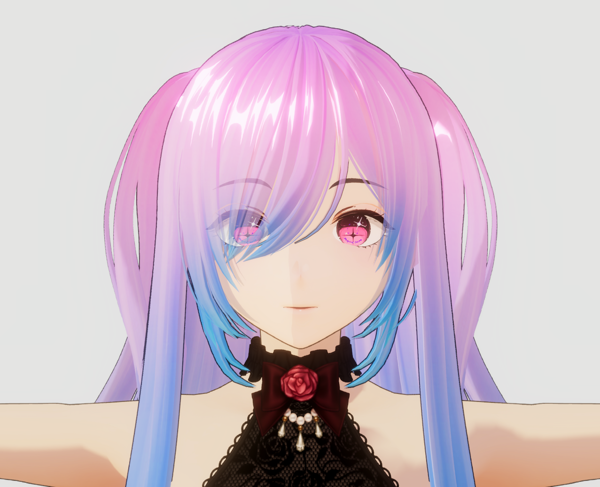
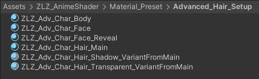
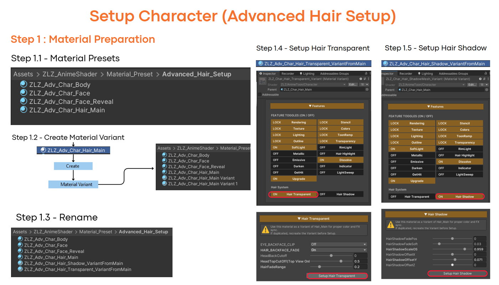
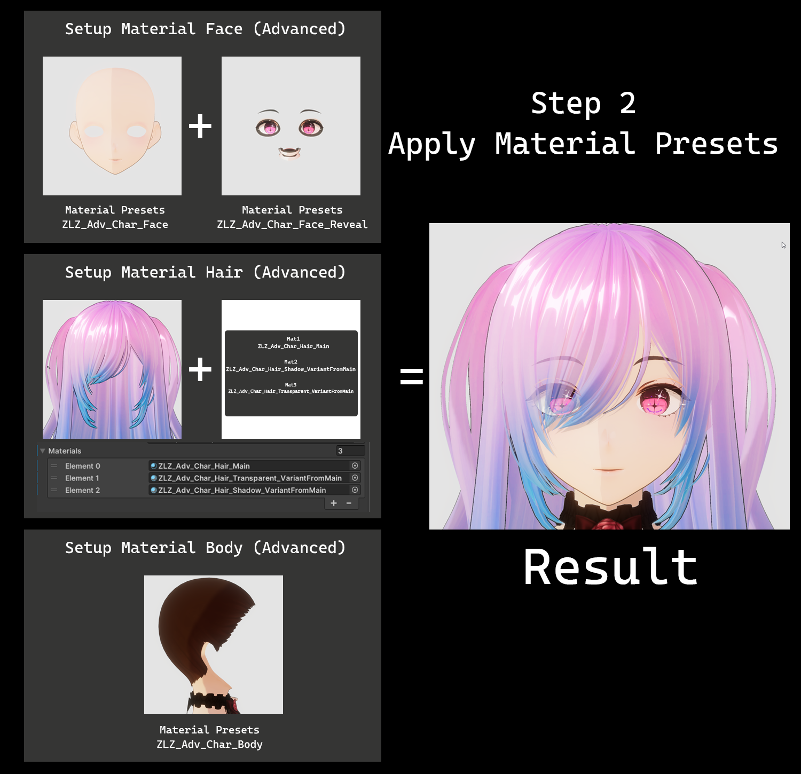
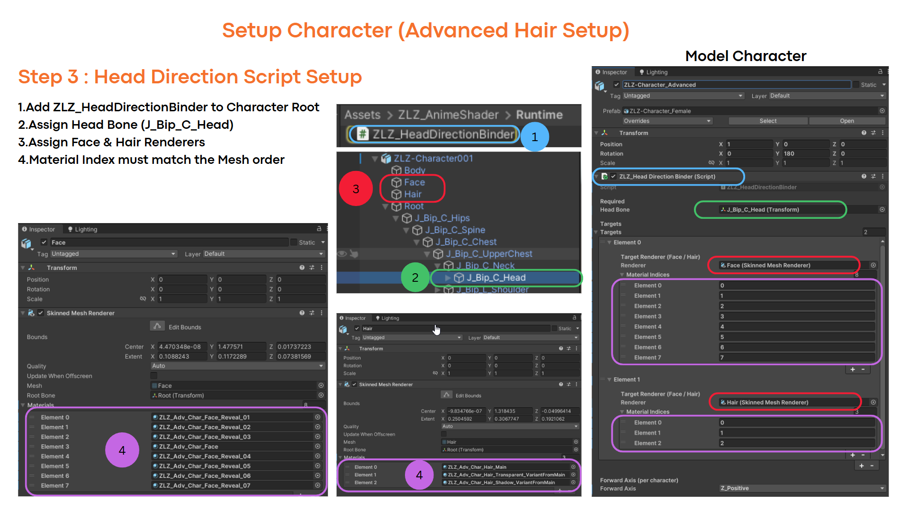
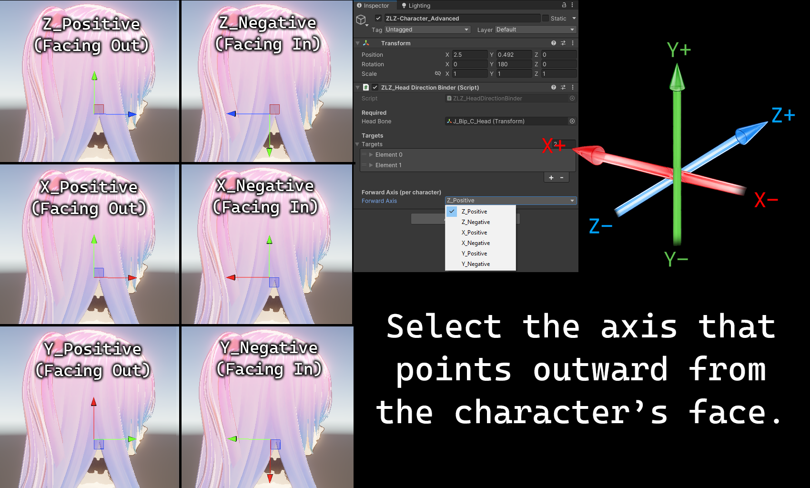
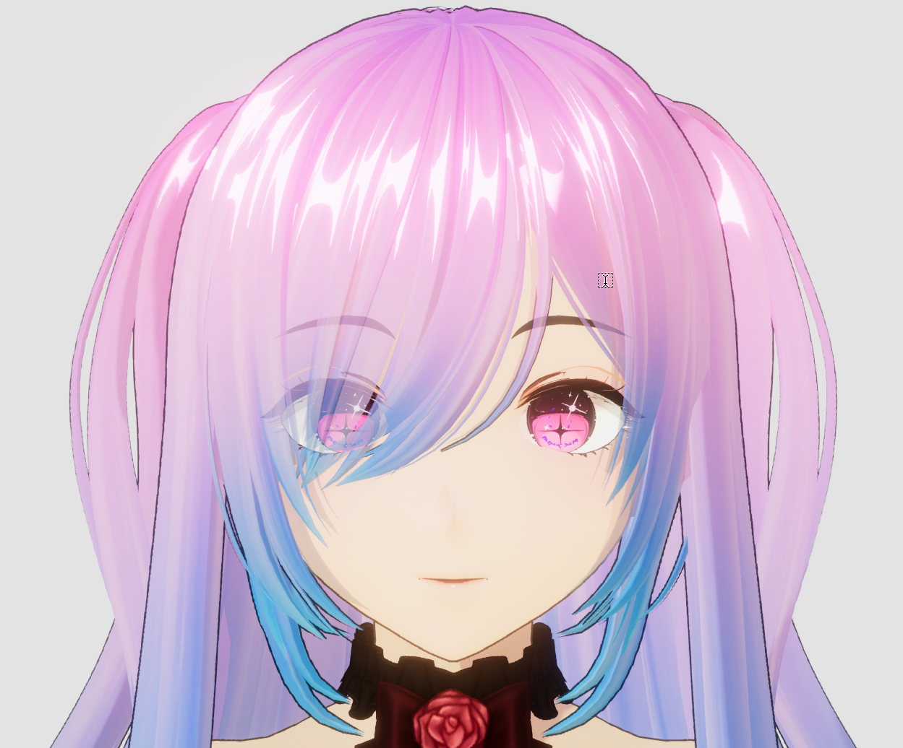

# Advanced Hair Setup

[← Back to Setup Character]({{ "/setup-character/" | relative_url }})

## Advanced Hair Setup

Suitable for users who want to enhance the visual quality of their characters.

Especially for rendering front hair to appear transparent and natural,

without blocking the face and eyes, which is a commonly used approach in production-level anime games.

- Fully supports all core shader features
- Ready to use immediately, though additional documentation for this section may be required
- **Supports** transparent hair rendering, allowing the face, eyes, and eyebrows to remain visible through front hair *(Hair Transparent)*
- **Supports** the hair shadow system *(Hair Shadow)*

> This setup approach is suitable for users who aim for visual quality on the same level as commercial anime games
and require more detailed control over the hair rendering system.
> 

---

### Material Presets Advanced Hair Setup

When setting up a single character, this system uses a total of **six main Material Presets**, as listed below:

1. **ZLZ_Adv_Char_Body** — Used for the character’s outfit or body parts
2. **ZLZ_Adv_Char_Face** — Used on the character’s face and serves as the base for visibility control, allowing hair to render transparently in a correct manner
3. **ZLZ_Adv_Char_Face_Reveal** — Used for the eyes, eyebrows, and facial elements that need to remain visible even when partially occluded by hair
4. **ZLZ_Adv_Char_Hair_Main** — Used for the main hair of the character and acts as the primary material for hair rendering
5. **ZLZ_Adv_Char_Hair_Shadow_VariantFromMain** — Used for hair layers that require transparent rendering, helping reduce occlusion of the character’s face and eyes
6. **ZLZ_Adv_Char_Hair_Transparent_VariantFromMain** — Used to generate additional hair shadows, enhancing depth and overall visual quality of the character

> Path : Assets/ZLZ_AnimeShader/Material_Preset/Advanced_Hair_Setup
> 

---

## Step 1 : Material Preparation (Advanced Hair Setup)

### [Video Tutorial Setup Step 1](https://youtu.be/-Qr4eKoO0XU)

---

## Step 2 : Apply Material Presets (Advanced Hair Setup)

### [Video Tutorial Setup Step 2](https://youtu.be/d2omoCJ5JyI)

---

## Step 3 :Head Direction Script Setup (Advanced Hair Setup)

### [Video Tutorial Setup Step 3](https://youtu.be/ZGY9uj1AxBQ)

---

## Step 4 : Select Forward Axis (Advanced Hair Setup)

### [Video Tutorial Setup Step 4](https://youtu.be/XlFdRWyGbaU)

---

## Final Setup Overview

