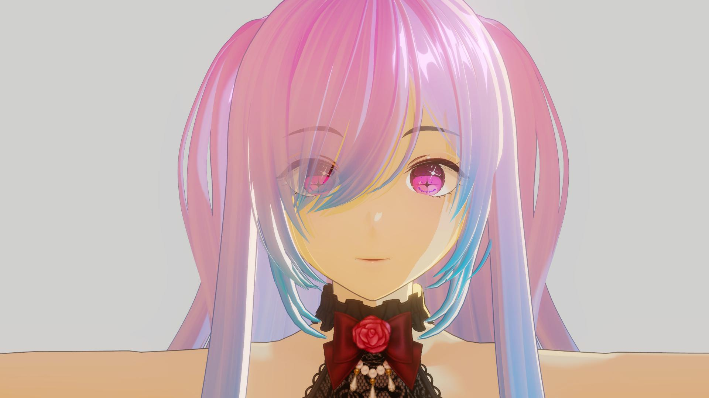

# Setup Character

### ZLZ Anime Shader Character

This document explains how to set up a character for use with **ZLZ Anime Shader Character**.
The shader is designed around a **role-based material** workflow, allowing multiple levels of character setup.

You can choose the approach that best fits your mesh structure and experience level,

without being required to use every feature.

---

## Overview

### Importance of Tone Mapping

Tone Mapping has a significant impact on the final look of the character.
It is recommended to set up Tone Mapping before adjusting the character’s materials.

### Choose the Setup Level That Suits You

  

    
  

  

    
  

  

  
Standard Setup

  
Advanced Setup

This shader supports **two setup approaches** to accommodate different visual requirements.

You may choose either approach, as both provide full access to the shader’s functionality.

- Standard Setup — A simple and fast setup suitable for most characters
- Advanced Hair Setup — An advanced setup for controlling hair-related systems such as Hair Transparent and Hair Shadow

---
